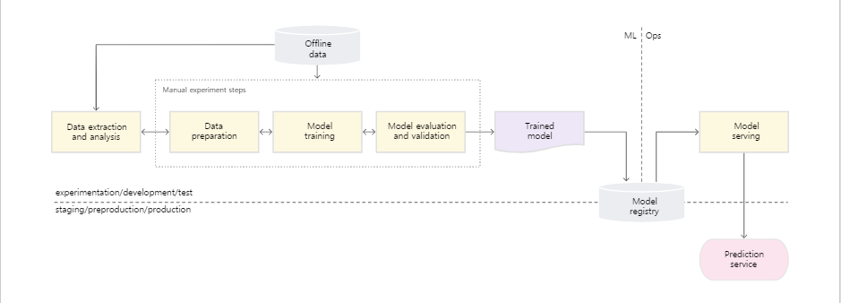
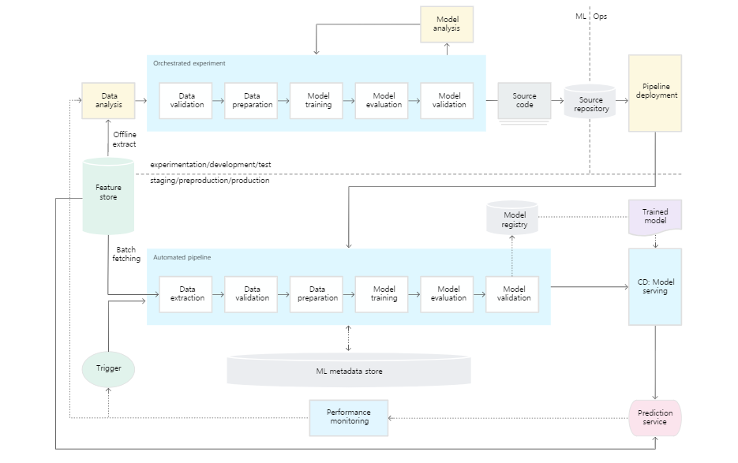
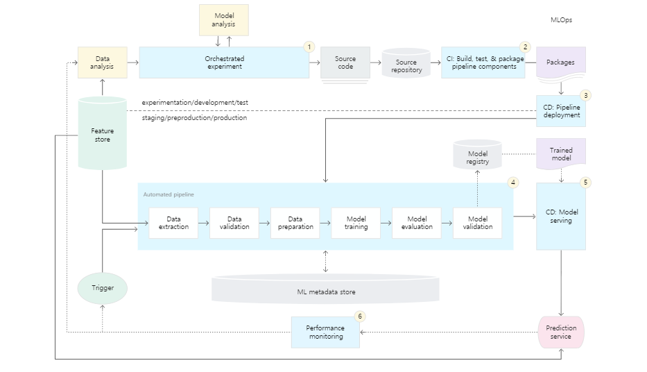

# Section 0. 머신러닝 파이프라인 소개
- 출처: https://www.inflearn.com/course/머신러닝-엔지니어-실무/

[back to super](https://github.com/jinmang2/boostcamp_ai_tech_2/tree/main/o-stage/mlops)


## 머신러닝 파이프라인의 이해

**강의 세 줄 요약**
```
모델 학습으로 끝내는 시대는 없다. ML Pipeline 구축은 필수
DevOps와 MLOps은 많이 다르지만 MLOps는 기본적으로 실험이라는 점 기억
CI/CD 뿐만 아니라 CT! 굉장히 중요함
```

### 파이프라인을 통해 얻는 이점
1. **생산성 향상**
    - 수 백개의 모델을 서빙해야 한다면?
    - 인간의 인지 능력의 한계! 관리해줄 툴이 있어야 한다.
2. **예측 가능한 품질**
    - 배포하고 끝? 아니다! 품질 관리를 시스템화해야 control 가능함
3. **장애 대응 능력 향상**
    - ML 프로젝트는 장애가 장애인지를 모르는 경우가 많음!
    - 즉, 인지조차 어렵고 인지하더라도 어떻게 대응해야할 지 막막한 경우가 많음
    - 때문에 pipeline을 구축하는 것은 scalability 관점에서도 중요!

### ML Pipeline의 필요성
어떤 모델이 정말 중요하게 대박이 났을 때 POC(Proof of Concept)을 해서 product로 끌어올리는 작업이 `pipelining`!

대부분의 회사에서 모델 배포는 쉬워졌지만, 모델을 운영하기가 힘듦!!

`Contiguous Integration`, 미래의 나를 위해서 시스템화시켜서 고생하지 않도록 효율적으로 만드는 것!

**Technical Debt(기술 부채)**
- Ward Cunningham, 1992

모델의 성능이 떨어졌을 때를 미리 고민하고 기술 부채를 줄여나가아 함!

Then, how? 이전에 `software engineering`에선?
- 리팩토링
- 종속성 제거
- 단위 테스트
- API 강화
- 미사용 코드 삭제
- 문서화

위의 과정으로 ML에서도 문제가 해결될 수 있을까? Nope!
- 소프트웨어 공학에서 얘기하는 **추상화(Abstraction)** 의 경계가 ML 시스템에서 미묘하게 무너짐!

Why?
- 기존엔 서로 공유하는 특성들과 함수들이 명확해서 관리하기 편했지만, ML에선 추상화가 잘 안됨!
- 하나의 거대한 모델의 일부만 고친다? 어려움
- Unit Test? 어떤 기능만 테스트할건데? 어려움
- 이전 방식은 잘 먹히지 않는다! 어떻게 제거할 수 있을까?

**Machine Learning Pipeline 강의에서 이를 배워봅시다**

### 머신러닝 문제의 특징
머신러닝 문제는 어떤 특징을 지니고 있을까?

- **Dataset은 진화한다!**
    - 데이터셋이 MNIST처럼 고정되어 있을까? Nope!
- **Metric도 진화한다!**
    - Dataset이 바뀌었는데 Accuracy만 볼거야?
- **모델은 재생산(Reproduce) 가능해야해!**
    - 모델 학습 및 추론하고 끝?
- **문제 정의가 우선!**
    - 무슨 문제를 푸는지도 모른다고?
- **예상치, 데이터 및 모델 검증은 필수!**
    - ML 프로젝트는 장애가 장애인지도 모르는 경우가 많다!
- **Explainability**
    - 예측하고 끝이 아니라 시각화, 요약, 이해 등으로 설명할 수 있어야 한다
- **Bias**
    - 데이터가 편향되진 않았는가? 항상 통계치로 관리하라!
- **Model Registry**
    - Model 버전 별 특징, 성능, FrameWork 등 하나의 아티펙트, 표준화된 방식으로 관리되야 한다!
- **Team의 구성**
    - Research Scientist(PhD), Research Engineer, Software Engineer
    - 서로 협업이 어려운 상태일 가능성이 너무 높다!
- **Develop Process**
    - ML은 본질적으로 실험임! 밤샌다고 되는게 아님...
    - 다른 Feature, 알고리즘, 모델링 기술 및 파라미터 구성을 시도하여 가능한 빨리 문제점에 적합한 것을 Search
    - 무엇이 효과가 좋았는지 관리가 안되는 경우가 대다수임
    - 재현성 유지가 과제임
- **테스팅 방법**
    - ML 시스템 테스트는 SW 시스템 테스트보다 더 복잡함.
    - contiguous integration
    - scalining out
    - code와 model 같이 배포
    - trigger point가 여러군데 있음
- **Production**
    - coding뿐만 아니라 지속적으로 data가 바뀜!
    - 데이터의 통계치를 추적하고 모델의 온라인 성능을 모니터링해서
    - 예상치를 벗어날 때 알림을 보내거나 롤백해야 한다.

### MLOps의 핵심 문제

모델 학습 / 배포 트리거

- 머신러닝 시스템은 다음과 같은 상황에서 학습과 모델을 배포한다
    - 요청 시: 파이프라인의 임시 수동 실행
    - 일정 기준: 라벨이 지정된 새 데이터는 매일. 매주 또는 매월
    - 새 학습 데이터: 새 데이터가 들어오는 경우 모델의 재학습을 트리거
    - 모델 성능 저하 시: 성능 저하가 눈에 띄는 경우 모델 재학습
    - 데이터 분포의 중요한 변화 시 (Concept Drift)
        - 온라인 모델의 전체 성능을 평가하기는 어렵지만 예측을 수행하는 데 사용되는 피쳐의 데이터 분포에 큰 변화가 있으면, 모델이 오래되었다는 걸 뜻함


진화하는 데이터셋과 Metric

- Data Pipeline을 처음부터 끝까지 설계해야함
- Accuracy만 볼거임? 당연히 아니죠

관리 포인트

- 지속적 통합 (Continuous Integration)
- 지속적 배포 (Continuous Deployment)
- 지속적 학습 (Continuous Training)
    - 데이터 파이프라인 자동화
    - ML 프로젝트 문제점 해결해야함

### MLOps 성숙도 레벨

**Level 0**
- 현재 대다수의 AI 회사들의 현실



- 수동, 스크립트 중심, 대화식(Interactive) 프로세스
- ML과 운영의 분리
- 드문 릴리즈 반복
- CI 없음
- CD 없음
- 배포는 예측 서비스를 의미
- Active 성능 모니터링 부족

**Level 1**
- 여기까지만 해도 훌륭함!



- 빠른 실험
- 프로덕션 모델의 CT
- 실험 운영 환경의 조화
- 구성 요소 및 파이프라인을 위한 모듈화된 코드
- 지속적인 모델 제공
- 파이프라인 배포

**Level 2**



- Production에서 파이프라인을 빠르고 안정적으로 업데이트하기 위해 자동화된 CI/CD 시스템을 사용! (Kubeflow)
- 이 자동화된 CI/CD 시스템을 통해 Data Scientist는 Feature Engineering, 모델 아키텍처 및 하이퍼 파라미터에 대한 새로운 아이디어를 신속하게 탐색 가능


위 내용에 대한 자세한 내용은 원문 [Google Clound](https://cloud.google.com/architecture/mlops-continuous-delivery-and-automation-pipelines-in-machine-learning)을 참고!

## 머신러닝 파이프라인 단계

**강의 세 줄 요약**
```
Data Versioning은 매우 중요! + Train/Test split은 데이터 검증 단계에서!
Model 학습 및 전처리, Feature Engineering 및 AutoML은 한 프로세스에 담는게 좋음
Model 배포하기 전 검증 및 버저닝 잊지 않기! 배포 후 피드백 루프 만드는 것도 중요
```

### 머신러닝 파이프라인 개요
- 아래 단계를 수동으로 수행한다? 번거롭고 오류가 발생하기 쉬움 ;;

```
   Data Ingestion / Versioning
-> Data Validation
-> Data Preprocessing
-> Model Training <-> Model Tuning
-> Model Analysis
-> Model Validation
-> Model Deployment
-> Model Feedback
```

- 데이터가 많을 수록 모델이 개선됨! Data Engineering?
    - 최종적으로 원하는 형태의 Dataset을 머리로 그려보라!
    - 이를 원천적으로 어떻게 얻어낼지를 역으로 설계하라!

### 데이터 수집, 버전관리, 데이터 검증

**데이터 수집 (Data Ingestion/Versioning)**

데이터 수집은 모든 머신러닝 파이프라인의 시작! 해당 단계에서는 다음 구성 요소가 소화(integration)할 수 있는 형식으로 데이터를 처리. feature engineering은 데이터 유효성 검사 이후에 수행됨! (수집과 동시에 수행하지 않음)

TFDV란 것을 활용하면 Data Drift도 파악이 쉽다고 한다.

`Data Versioning`이 중요한 이유! 어떤 pipeline에서 어떤 데이터를 사용할 지 log에 남기면 됨!

Serialize해서 object storage에 담아두면 query할 때 매우 편함!

**데이터 유효성 검사 (Data Validation)**

새 모델 버전을 학습하기 전에 검증하는 단계! 새 데이터의 통계가 예상대로 인지 확인하고 만일 이상 징후가 감지될 경우 데이터 과학자에게 경고!

Dataset Scheme가 달라진달지 Data가 잘못 되었을 경우 Pipeline이 깨지는 경우가 생각보다 빈번함.

`Data Split`도 여기서 수행! 이거 나도 많이한 실수인데, Training 단계에서 train/test split을 할 경우 모델 간의 비교가 불가능해짐! 때문에 이를 데이터 검증 단계에서 수행하는 것이 좋음

여기서 `Class Imbalance`를 잘 맞춰주는 것 또한 `Generalization` 관점에서 매우 중요! 이를 TFDV가 또 해준다고 하네요

**데이터 전처리 (Data Preprocessing)**

새로 수집한 데이터가 모델이 원하는 포맷이 아닐 경우가 많음! (text 쌍을 cross encoder에 넣어주기 위해서 batch form, tensor화, concat 등 필요) 때문에 이를 모델에 맞게 전처리해주는 작업이 필요함.

Feature Engineering을 이 단계에서 수행할 수도 있음! 강사님은 Feature Space가 어떤지가 중요하다고 생각함. AutoML의 범위를 전처리 단계까지 포함해주면 효율적인 성능 향상이 가능해진다.

최대한 CPU를 열심히 돌려서 배치 단위로 처리해주는 것이 좋음! `(Caching은 필수)`

### 모델 학습, 모델 분석, 모델 버전 관리

**모델 학습 (Model Training)**

머신러닝 파이프라인의 핵심! 가장 낮은 오차를 사용하여 입력을 수행하고 출력을 예측하는 모델을 학습! 모델 훈련의 효율적인 분포가 매우 중요함!

AutoML에 대한 Early Stopping이 중요함! 왜냐, 어느정도가면 Model 성능이 Saturation됨

**모델 튜닝 (Model Tuning)**

AutoML! ML 프로젝트에 따라 머신러닝 파이프라인을 고려하기 전에 모델을 튜닝하도록 선택하거나 파이프라인의 일부로 튜닝하는 것이 좋음!

ML Pipeline Architecture는 확장 가능! 때문에 다수의 모델을 병렬 또는 순차적으로 학습시킬 수 있음

Feature Space, Ensemble Search 방법들 등 다양함!

**모델 분석 (Model Analysis)**

TFMA, slicing해주는 것! 예를 들어 인구 조사 Data, 결혼 상태에 따른 performance? (`What If Tool`)

모델의 최종 버전을 결정한 후에는 성능에 대해 심층적으로 분석하는 것이 매우 유용함!

모델의 예측이 공정하다는 것을 확인해주는 역할을 하기도 함

**모델 버전 관리 (Model Validation)**

어떤 모델, hyperparameter set 및 dataset이 선택되었는지 추적하는 단계! 굉장히 중요한 단계임. trigger point가 다르기 때문에 학습되었다고 다 배포하지 않음! `Model A/B Test`

### 모델 배포, 피드백 루프 반복, 개인 정보 보호

**모델 배포 (Model Deployment)**

모델을 학습, 튜닝 및 분석한 뒤, 모델을 배포. 유감스럽게 일회성 구현으로 구현된 모델이 너무 많다면, 모델 업데이트는 쉬운 프로세스가 아님

기본적으로 PyTorch가 serving에 좋은 Tool은 아닌 듯... ㅎㅎ 형상 관리하기가 힘듦

모던한 모델 서버를 사용하면 웹 서버 프로그램 코드를 작성하지 않고도 모델 배포가 가능! REST(대표성 상태 전송) 또는 RPC(원격 프로시저 호출) 프로토콜과 같은 여러 API 인터페이스를 제공, 동일한 여러 버전을 동시에 호스트할 수 있는 경우가 많다고 함.

**피드백 루프 반복 (Model Feedback)**

새로 배포된 모델의 효과와 성능을 알 수 있도록 피드백 루프를 만들어서 예측 결과, ground truth를 받을 수 있다면 받아봐야 한다.

피드백이 있으면 데이터 drift 확인도 가능하고 trigger 부여할 수도 있음

`TFDB`를 꼭 쓰는 것을 추천!

Research vs Engineer, 인센티브가 다름!

**개인 정보 보호**
- 차등 개인 정보 보호 (`Differential Privacy`)
- 연합 학습 (`Federated Learning`)
- 암호화된 머신 러닝 (`Encrypted Machine Learning`)
