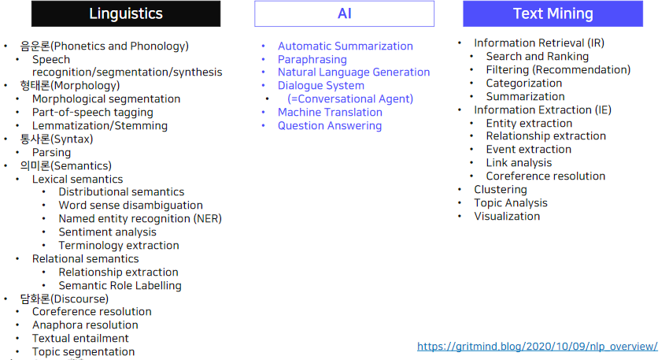
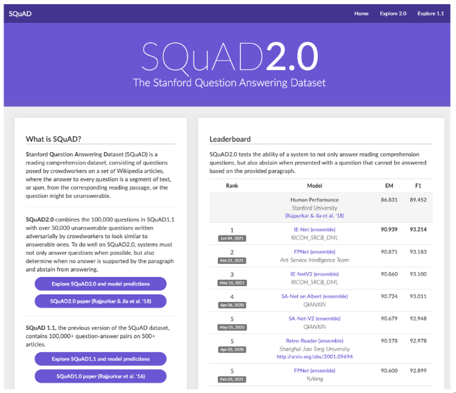
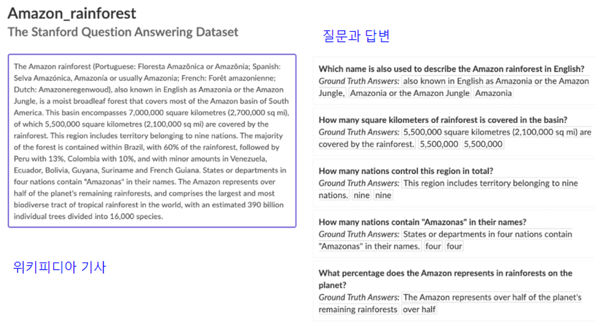
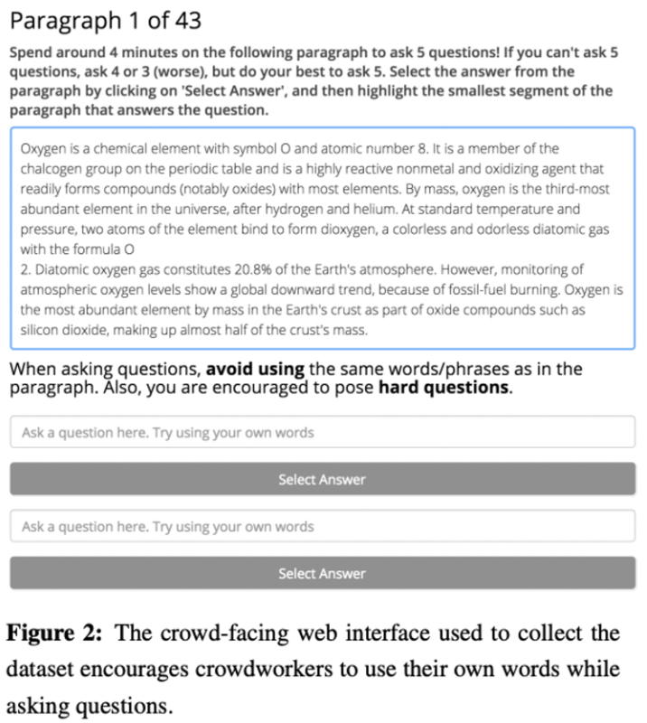
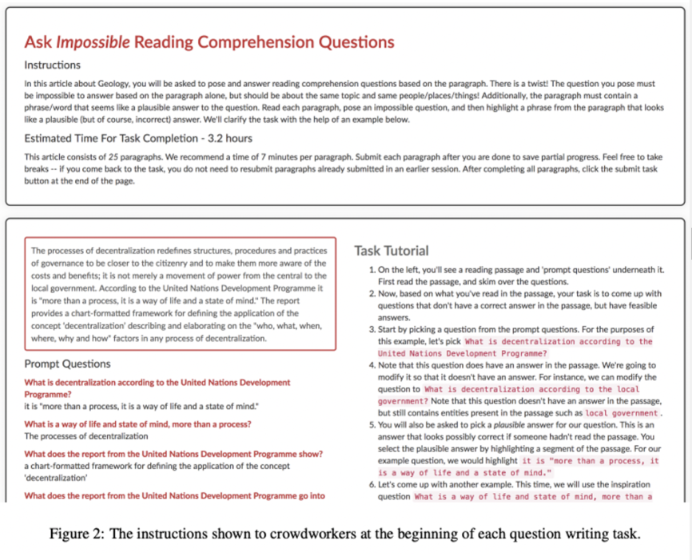
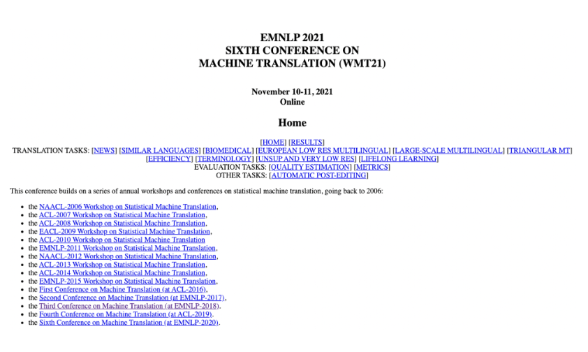
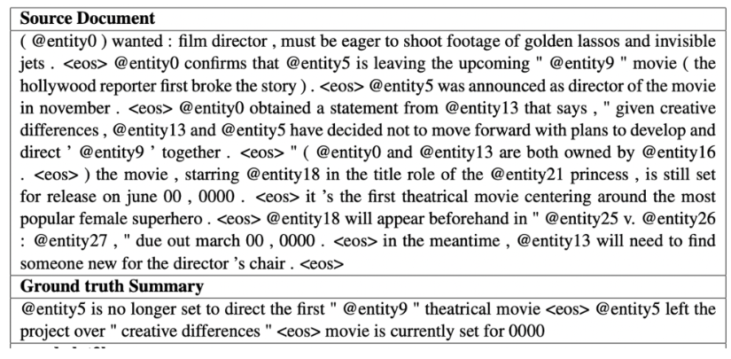
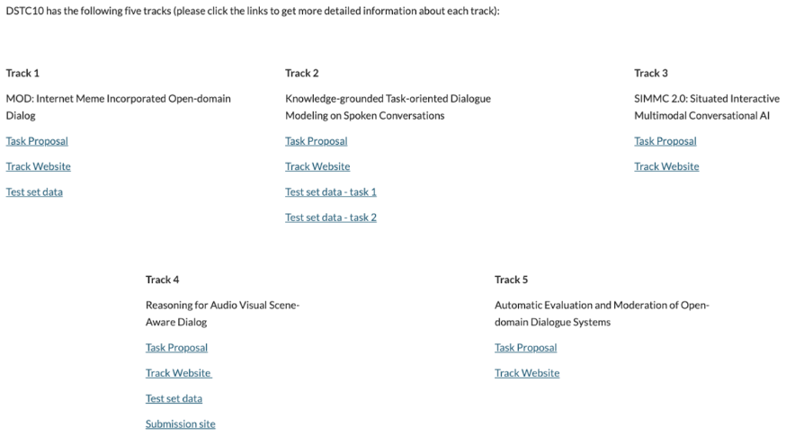
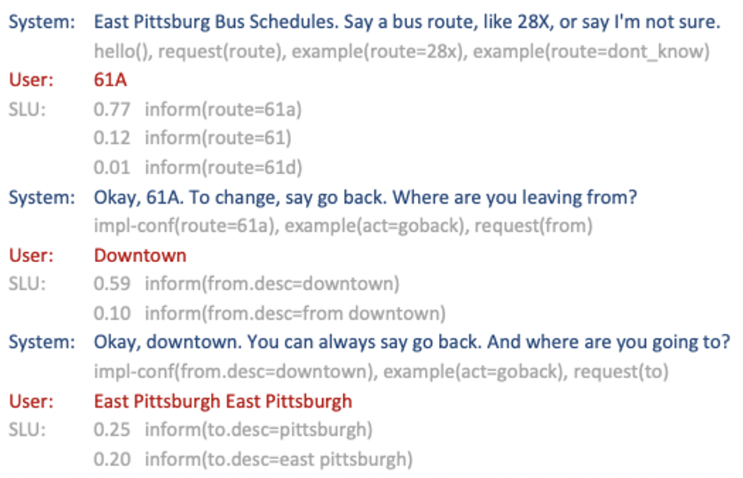
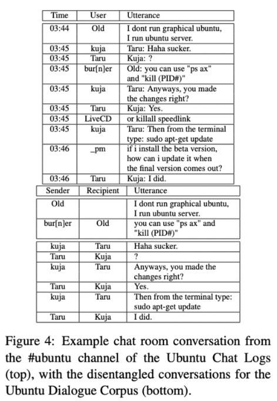

# 4강 자연어처리 데이터 소개 2

[back to super](https://github.com/jinmang2/boostcamp_ai_tech_2/tree/main/p-stage/data_annotation)

## 0. NLP Basic Tasks

자연어 처리에 관심이 많은 세 가지 분야
- Linguistics
    - 기존: 언어학자의 직관에 의해 어떤 문법이 말이 되고 사람들이 어떻게 말을 하는지?
    - 말뭉치 언어학: 실제 데이터를 분석
        - Text가 필요함!
        - e.g., 형태론 -> 구문분석
        - e.g., 의미론 -> 어떤 단어가 어떤 단어와 같이 등장하는지?
        - 밖에, 바깥 + 에
        - 갈래뜻: word sense
        - Word sense disambiguation
    - Semantic Role Labeling
        - 서술어에 대해 주어와 그것이 말하는 대상은 고정적
        - 위에 대해 주석을 수행
        - e.g., 선생님이 문을 닫았다
        - 주격조사 -이
        - 목적격조사 -을
        - 선생님: 행위의 주체, 물: 행위의 대상
            - 이게 의미역임!
        - 피동문
        - Slot Filling에도 사용될 수 있음
- AI
    - 인공지능이 주석의 정보를 알도록!
    - Interface -> 서비스 역할이 가능한
    - Paraphrasing: 동일한 문장을 다른 표현으로
    - AI part의 문제를 해결하기 위해 전산언어학에서 연구된 내용이 필요
- Text Mining
    - Information Retrieval, Information Extraction, Clustering, Topic Analysis, Visualization

## 1. 질의응답 Question Answering

### SQuAD
위키피디아 데이터를 기반으로 제작한 기계 독해 및 질의응답 데이터

- URL: https://rajpurkar.github.io/SQuAD-explorer/

### SQuAD 2.0 데이터 형식

### SQuAD 1.0 데이터 구축

1. 구축 대상 기사 추출
    - 위키피디아 상위 10,000 기사 중 500자 이하인 536 기사 무작위 추출
2. 크라우드 소싱을 통한 질의 응답 수집
    - 각 문단마다 다섯 개의 질문과 답변 수집
3. 추가 응답 수집
    - 평가를 통해 각 질문 당 최소 두 개의 추가적인 답변 수집
    - 기사의 단락과 질문 노출 후 가장 짧은 대답 선택

- 지시문을 어떻게 줄 것인가? 도 매우 중요함
- 양질의 데이터를 얻는 것이 핵심
- 지시 사항: 본문에 나오는 단어를 사용하지 마세요!

### SQuAD 2.0 데이터 구축

1. 크라우드 소싱 플랫폼을 통한 대답하기 어려운 질문(unanswerable questions) 수집
    - 각 문단마다각 문단 만으로는 대답할 수 없는 다섯 개의 질문 생성
    - 적합한 질문을 25개 이하로 남김
2. 적합한 질문이 수집되지 않은 기사 삭제
3. 학습, 검증, 평가용 데이터 분할

https://arxiv.org/abs/1806.03822

- 위 제작 과정은 논문에 다 작성이 되어 있음!

## 2. 기계 번역 Machine Translation

### WMT 데이터셋

- Workshop on Machine Translation

2014년부터 시행된 기계 번역 학회에서 공개한 데이터셋 다국어 번역 데이터이며, 두 언어 간의 병렬 말뭉치로 구성됨.

뉴스, 바이오, 멀티 모달 데이터 등이 제공됨

### WMT 데이터셋 - 데이터 형식 2020

- XML 형식
- ID가 굉장히 중요함!!

### WMT 데이터셋 - 데이터 구축 2018년 기준

평가용 데이터: 1,500개의 영어 문장을 다른 언어로 번역 + 1,500개의 문장은 다른 언어에서 영어 문장으로 번역

훈련용 데이터: 기존에 존재하는 병렬 말뭉치와 단일 언어 말뭉치를 제공

http://www.statmt.org/wmt18/pdf/WMT028.pdf

## 3. 요약 Text Summarization

### CNN/Daily Mail

추상 요약 말뭉치. 기사에 대하여 사람이 직접 작성한 요약문이 짝을 이루고 있음.

학습 데이터 286,817 쌍, 검증 데이터 13,368 쌍, 평가 데이터 11,487 쌍으로 구성

https://github.com/abisee/cnn-dailymail

- `@entity0`: 개인 정보 masking (익명화)
- `<eos>` end of sentence

### XSum
설명에는 없지만 더 어려운 task가 존재함

## 4. 대화 Dialogue

### DSTC - Dialog System Technology Challenges

**DSTC1**
- human-computer dialogs in the bus timetable domain

**DSTC2 and DSTC3**
- human-computer dialogs in the restaurant information domain

**DSTC4 and DSTC5**
- DSTC4 human-human dialogs in the tourist information domain

**DSTC6 이후**
- End-to-End Goal Oriented Dialog Learning, End-to-End Conversation Modeling, and Dialogue Breakdown Detection으로 확장

### DSTC1 - 데이터 형식

### Wizard-of-Oz

WoZ 방식으로 수집된 데이터셋이며 대화 상태 추적 데이터와 유사한 형태로 이루어짐

WoZ 방식은 대화 수집 방식의 하나로, 참여자가 대화 시스템을 통해 대화를 하고 있다고 생각하게 한 뒤 실제로는 실제 사람이 참여자의 발화에 맞추어 응답을 제시하고 대화를 이끌어가면서 대화를 수집하는 방식

https://huggingface.co/datasets/woz_dialogue

### UDC (Ubuntu Dialogue Corpus)

우분투 플랫폼 포럼의 대화를 수집한 데이터

100만 개의 멀티 턴 대화로 구성, 700만 개 이상의 발화와 1억개의 단어 포함. 주석 X

대화 상태 추적과 블로그 등에서 보이는 비구조적 상호작용의 특성을 모두 가지고 있음

https://arxiv.org/pdf/1506.08909v3.pdf

## Further Reading
- [Hugging Face Dataset Hub](https://huggingface.co/datasets)
- [Papers with Code - NLP section](https://paperswithcode.com/area/natural-language-processing)
