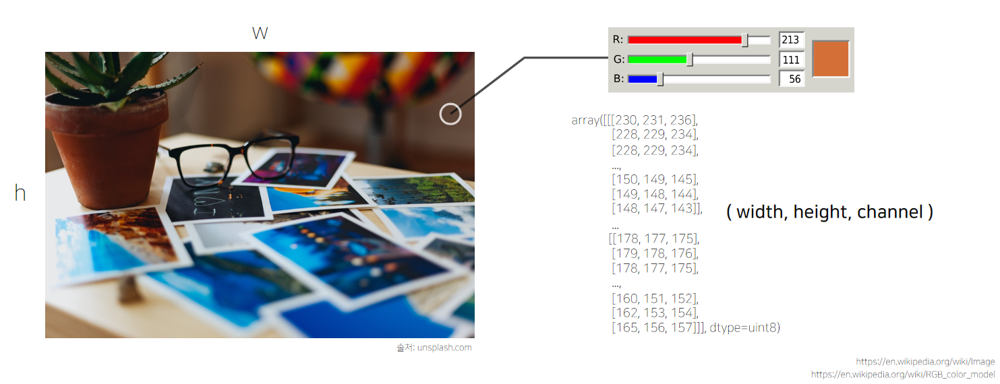
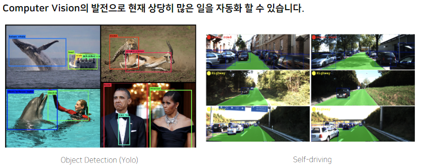
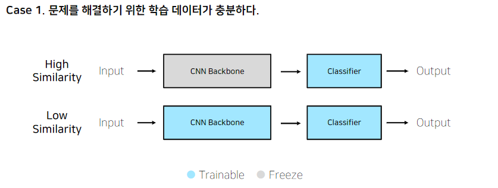
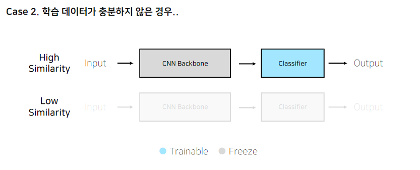
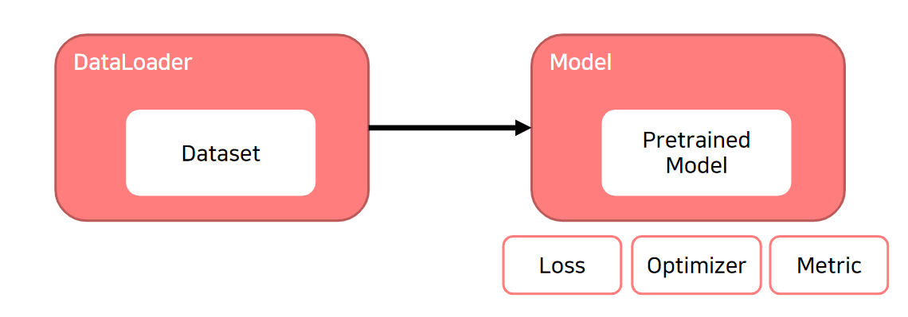
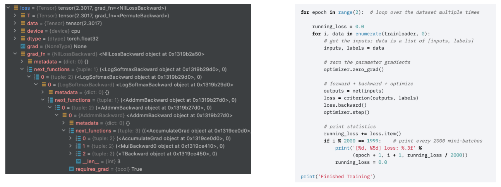
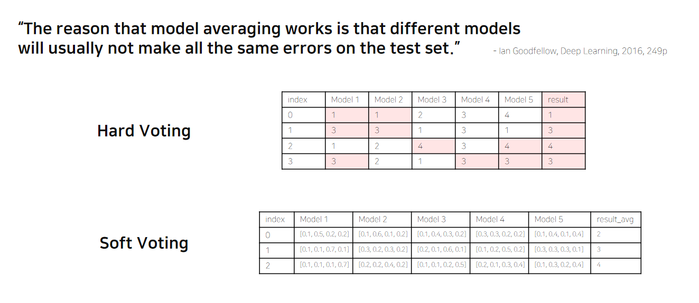
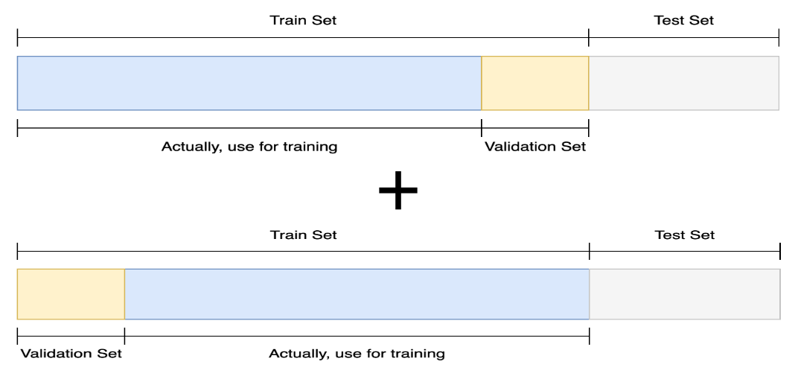
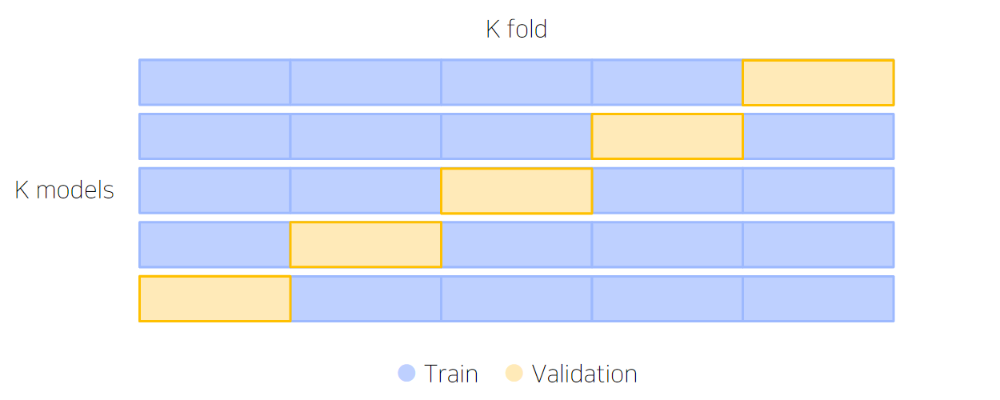
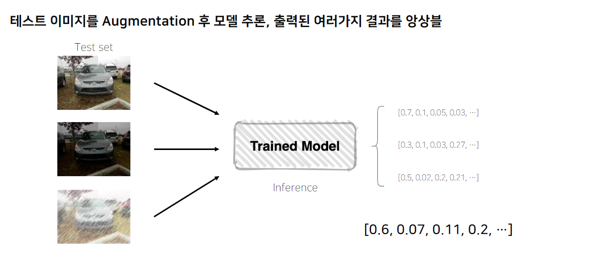

# Image Classification 대회
- 김태진 마스터

## Day 1 `21.08.23`
- 내가 지금 풀어야할 **문제가** 무엇인지 정의하는 것이 제일 중요!

### EDA (Exploratory Data Analysis)
- 탐색적 데이터 분석, 데이터를 이해하기 위한 노력

### Image Classification
- 시각적 인식을 표현한 인공물 (Artifact)



### Wrap-Up
- `huggingface`를 사용하여 baseline 구축
- 첫 날에 F1 score `71.27`점을 기록, private score 3등을 기록했다!
- 곧 깨질 예정이지만, 이번 대회 TOP 30을 목표로 달려보자!
- [Special Mission: EDA](https://github.com/jinmang2/boostcamp_ai_tech_2/p-stage/image_classification/special_missions/EDA)


## Day 2 `21.08.24`
- 주어진 Vanilla Data를 모델이 좋아하는 형태의 Dataset으로!

### Pre-processing


- 가끔 필요 이상으로 많은 데이터를 가지고 있기도 한다!
    - 예를 들어 배경 등
    - Bounding Box: 필요한 데이터만 사용!

- 계산의 효율을 위해 적당한 크기로 사이즈를 조절해주기도 한다.

### Generalization
- Bias & Variance Trade-off를 잘 맞춰줘야 한다
- Trian / Valication으로 과적합 체크는 필수!
- Data Augmentation
    - 일반화 및 성능 증진에 필수
    - 주어진 데이터가 가질 수 있는 case, state의 다양성!
- `torchvision.transform`
- `Albumentations`

### Data Feeding
- 모델에게 먹이를 주다? 대상의 상태를 고려해서 적정한 양을 준다
- 아무리 batch를 늘려도 generate 처리 능력 향상이 안된다면? batch 만큼의 속도가 안나올 것임


- `Dataset`과 `DataLoader`로 제작!

### Wrap-Up
- 10번 정도 모델을 계속 돌리고 실험
- 그런데 notebook으로 파일을 관리하니까 실험 관리가 제대로 안됐다...
- 때문에 이를 모듈화시키는 과정을 거쳤다
- 그리고 실험하는데 `transform`이 있고 없고가 일반화에 지대한 영향을 끼친다는 사실을 발견했다.
    - 이를 하지 않으면 학습 valid F1 90%까지 올라가지만 test F1은 70%대였다.
    - 수행했을 때 test F1은 비슷하게 나오면서 학습 valid 70%가 나왔다!
    - 이 성적을 올리면 test set에서도 올라갈 것!
- 라벨링이 잘 안되어 있는 sample이 있다는 소식을 들었다
    - 이에 대해 아이디어를 제시해서 내일 실험해볼 생각이다
- 등수가 많이 밀렸다... 열심히 해야겠다!
- [Special Mission: Dataset](https://github.com/jinmang2/boostcamp_ai_tech_2/p-stage/image_classification/special_missions/Dataset)

## Day 3 `21.08.25`

### Model
- 모델이 뭔가요?
    - In general, a model is an informative representation of an object, person or system

### Pytorch
- Low-level, Pythonic, Flexibility

### Pretrained Model


- 모델 일반화를 위해 매번 수 많은 이미지를 학습시키는 것은 까다롭고 비효율적

### Case by Case




### Further Reading
- Facebook AI Research(FAIR) 연구원이자 파이토치 라이트닝 프로젝트 오너인 Falcon 이 작성한 파이토치 성능향상을 위한 7가지 팁
    - https://towardsdatascience.com/7-tips-for-squeezing-maximum-performance-from-pytorch-ca4a40951259
    - https://bbdata.tistory.com/9
- Tesla 자율주행 연구소 Lead 인 Karpathy 가 트위터에 작성한 Pytorch Common Mistakes 해설
    - https://medium.com/missinglink-deep-learning-platform/most-common-neural-net-pytorch-mistakes-456560ada037
- 파이토치 꿀 기능. Autograd 의 official documentation 번역본
    - https://tutorials.pytorch.kr/beginner/blitz/autograd_tutorial.html
    - https://pytorch.org/docs/stable/notes/faq.html
    - https://pytorch.org/docs/stable/notes/modules.html

### Wrap Up
- `DeiT`로 `noise 추가`, `hyperparameter 조절` 등 다양한 아이디어를 추가해서 실험을 진행했으나, 첫 날의 performance를 얻는 것은 불가능했다.
- 그래서 모델을 `BeiT`로 바꿔봤다. 드디어 성능이 소폭 올라서 리더보드 등수를 조금 더 올렸다!
- 하지만 여전히 TOP 5의 길은 멀고도 험하다...
- 데이터셋에 labeling noise가 있는 것을 확인하고 active learning으로 해당 노이즈를 제거할 아이디어를 제출했다.
    - 그리고 내가 해결해서 공유하기로 했다.
- 이번주 개인 주간 때엔 여러가지 해결하고 실험하여 baseline 모델을 구축할 예정이다.

## Day 4 `21.08.26`

### Loss
- backpropagation
- loss도 사실은 `nn.Module` Family
- `loss.backward()`
- **Focal Loss**: Class Imbalance 문제가 있는 경우, 맞춘 확률이 높은 Class는 조금의 Loss를, 맞춘 확률이 낮은 Class는 Loss를 훨씬 높게 부여
- **Label Smoothing Loss**: Class target label을 OneHot 표현으로 사용하기 보다는 조금 soft하게 표현해서 일반화 성능을 높임

### Optimizer
- 어느 방향으로 얼마나 움직일 지?
- LR Scheduler
- **StepLR**: 특정 Step마다 LR 감소
    ```python
    scheduler = torch.optim.lr_scheduler.StepLR(optimizer, step_size=2, gamma=0.1)
    ```
- **CosineAnnealingLR**: Cosine 함수 형태처럼 LR을 급격히 변경
    ```python
    scheduler = torch.optim.lr_scheduler.CosineAnnealingLR(optimizer, T_max=10, eta_min=0)
    ```
- **ReduceLROnPlateau**: 더 이상 성능 향상이 없을 때 LR 감소
    ```python
    scheduler = torch.optim.lr_scheduler.ReduceLROnPlateau(optimizer, 'min')
    ```

### Metric
- 모델의 평가
- Score의 허와 실!
- **Classification**: `Accuracy`, `F1-Score`, `Precision`, `Recall`, `ROC & AUC`
- **Regression**: `MAE`, `MSE`
- **Ranking**: `MRR`, `NDCG`, `MAP`
- sample의 수에 따라 계산이 달라지기도 하고, 정확히 세팅을 맞춰줘서 올바르게 비교해야 함!

### Training Process



- `optimizer.zero_grad()`
    ```python
    def zero_grad(self, sen_to_none: bool = False):
        for group in self.param_groups:
            for p in group['params']:
                if p.grad is not None:
                    if set_to_none:
                        p.grad = None
                    else:
                        if p.grad.grad_fn is not None:
                            p.grad.detach_()
                        else:
                            p.grad.requires_grad_(False)
                        p.grad.zero_()
    ```

- `loss = loss_fn(outputs, labels)`
    ```python
    def __init__(self, weight: Optional[Tensor] = None, size_average=None, ignore_index: int = -100, reduce=None, reduction: str = 'mean') -> None:
        super(CrossEntropyLoss, self).__init__(weight, size_average, reduce, reduction)
        self.ignore_index = ignore_index
    def forward(self, input: Tensor, target: Tensor):
        return F.cross_entropy(input, target, weight=self.weight,
                               ignore_index=self.ignore_index, reduction=self.reduction)
    ```



- `optimizer.step()`
    ```python
    @torch.no_grad()
    def step(self, closure=None):
        """Performs a single optimization step.

        Arguments:
            closure (callable, optional): A closure that reevaluates teh model
                and returns the loss.
        """
        loss = None
        if closure is not None:
            with torch.enable_grad():
                loss = closure()

        for group in self.param_groups:
            params_with_grad = []
            grads = []
            exp_avgs = []
            exp_avg_sqs = []
            state_sums = []
            max_exp_avg_sqs = []
            state_steps = []
    ```

- **Gradient Accumulation**: 지금까지의 과정을 이해했다면 이를 응용하는 것도 가능!

```python
NUM_ACCUM = 2
optimizer.zero_grad()
for epoch in range(2):
    running_loss = 0.0
    for i, data in enumerate(train_loader, 0):
        inputs, labels = data
        outputs = net(inputs)

        loss = criterion(outputs, labels) / NUM_ACCUM
        loss.backward()

        if i % NUM_ACCUM == 0:
            optimizer.step()
            optimizer.zero_grad()
```

### Inferece Process
- `model.eval()`
- `with torch.no_grad()`
- Validation으로 검증!
- checkpoint, 그냥 직접 짜면 오케이!

### Wrap Up
- 성능이 계속해서 오르지 않는다... `DeiT`, `BeiT`, `ViT` 다 실험해보는데 리더보드 1위 탈환이 안된다...
- 결국 팀 병합 전 개인 9위로 마무리...
- 그래도 마지막에 왜 분류가 잘 안되지? 를 train-set에서 오분류된 sample들을 분석하면서 이를 교정해서 성능을 많이 올렸다!
    - 특정 의상을 입은 남/녀 샘플들이 있었다!
    - 이를 모델이 아예 구별하질 못하고, 성별을 반대로 예측하는 경우가 존재했다.
    - 이를 Crop size를 조절하고 sample weight를 추가로 더 줘서 교정했더니 F1 score가 1.37%정도 올랐다!
- 이후엔 학습 정리 및 코드 정리를 진행했다.
- Data Augmentation 및 Age를 어떻게 잡을지 고민했다.
- Luna, ResidualAttention Head로도 변경했으나 성능에 영향을 미치진 않았다.

## Day 5 `21.08.27`

### Ensemble
- voting



- Cross Validation



- - Stratified K-Fold Cross Validation



- Test Time Augmentation



### Hyperparameter Optimiation


### Training Visualization
- Tensorboard

```python
from torch.utils.tensorboard import SummaryWriter

logger = SummaryWriter(log_dir=f"results/{name}")
logger.add_scalar("Train/loss", train_loss, epoch * len(train_loader) + idx)
logger.add_scalar("Train/accuracy", train_acc, epoch * len(train_loader) + idx)

for idx, train_batch in enumerate(train_loader):
    inputs, labels = train_batch

grid = torchvision.utils.make_grid(inputs)
logger.add_image("image", grid, 0)
logger.add_graph(model, inputs)
```

```
tensorboard
    --logdir PATH # log가 저장된 경로
    --host ADDR   # 원격 서버에서 사용 시 0.0.0.0 (default: localhost)
    --port PORT   # 포트 번호
```

- Weight and Bias (wandb)
    - 난 이거 쓸래! 리얼 편함
    - 텐서보드 상위호환

### Python IDLE
- 디버깅 기능을 위해 pycharm과 친해져야 할 듯

### Wrap Up
- 오늘은 강의 정리 및 dataset 분석을 실시했다.
- 추가 외부 데이터셋으로 무엇을 사용할지도 분석했다.
