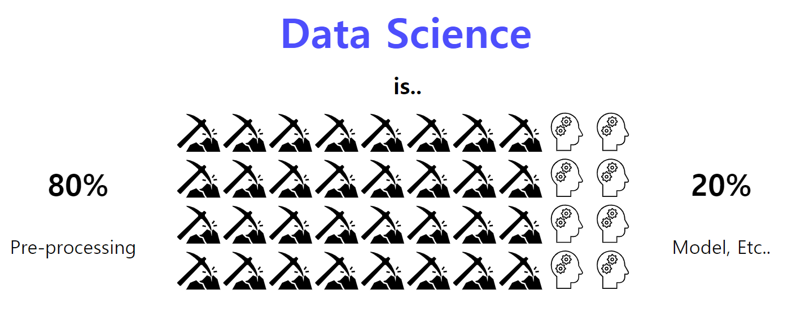
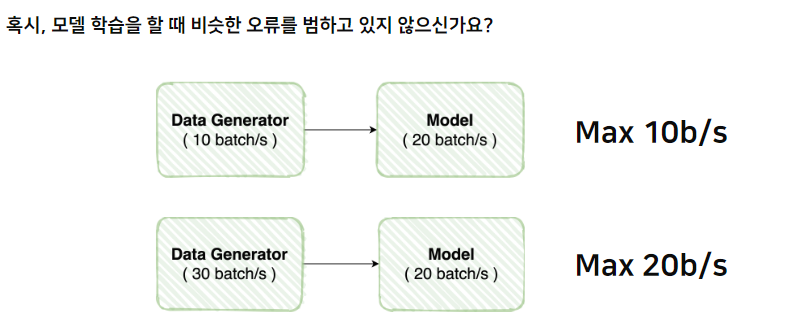

# Image Classification 대회
- 김태진 마스터

## Day 1
- 내가 지금 풀어야할 **문제가** 무엇인지 정의하는 것이 제일 중요!

### EDA (Exploratory Data Analysis)
- 탐색적 데이터 분석, 데이터를 이해하기 위한 노력

### Image Classification
- 시각적 인식을 표현한 인공물 (Artifact)

### Wrap-Up
- `huggingface`를 사용하여 baseline 구축
- 첫 날에 F1 score `71.27`점을 기록, private score 3등을 기록했다!
- 곧 깨질 예정이지만, 이번 대회 TOP 30을 목표로 달려보자!
- [Special Mission: EDA](https://github.com/jinmang2/boostcamp_ai_tech_2/p-stage/image_classification/special_missions/EDA)

## Day 2
- 주어진 Vanilla Data를 모델이 좋아하는 형태의 Dataset으로!

### Pre-processing

- 가끔 필요 이상으로 많은 데이터를 가지고 있기도 한다!
    - 예를 들어 배경 등
    - Bounding Box: 필요한 데이터만 사용!

- 계산의 효율을 위해 적당한 크기로 사이즈를 조절해주기도 한다.

### Generalization
- Bias & Variance Trade-off를 잘 맞춰줘야 한다
- Trian / Valication으로 과적합 체크는 필수!
- Data Augmentation
    - 일반화 및 성능 증진에 필수
    - 주어진 데이터가 가질 수 있는 case, state의 다양성!
- `torchvision.transform`
- `Albumentations`

### Data Feeding
- 모델에게 먹이를 주다? 대상의 상태를 고려해서 적정한 양을 준다
- 아무리 batch를 늘려도 generate 처리 능력 향상이 안된다면? batch 만큼의 속도가 안나올 것임

- `Dataset`과 `DataLoader`로 제작!

### Wrap-Up
- 10번 정도 모델을 계속 돌리고 실험
- 그런데 notebook으로 파일을 관리하니까 실험 관리가 제대로 안됐다...
- 때문에 이를 모듈화시키는 과정을 거쳤다
- 그리고 실험하는데 `transform`이 있고 없고가 일반화에 지대한 영향을 끼친다는 사실을 발견했다.
    - 이를 하지 않으면 학습 valid F1 90%까지 올라가지만 test F1은 70%대였다.
    - 수행했을 때 test F1은 비슷하게 나오면서 학습 valid 70%가 나왔다!
    - 이 성적을 올리면 test set에서도 올라갈 것!
- 라벨링이 잘 안되어 있는 sample이 있다는 소식을 들었다
    - 이에 대해 아이디어를 제시해서 내일 실험해볼 생각이다
- 등수가 많이 밀렸다... 열심히 해야겠다!
- [Special Mission: Dataset](https://github.com/jinmang2/boostcamp_ai_tech_2/p-stage/image_classification/special_missions/Dataset)
