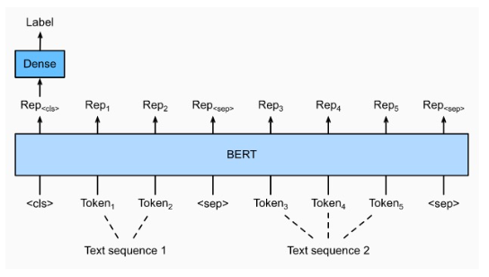
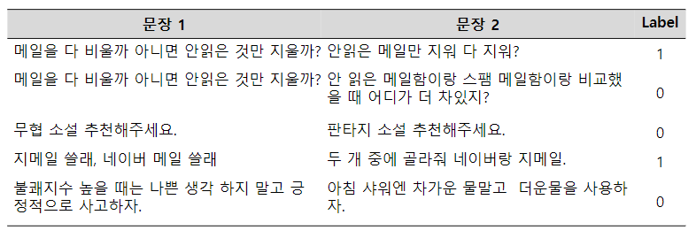
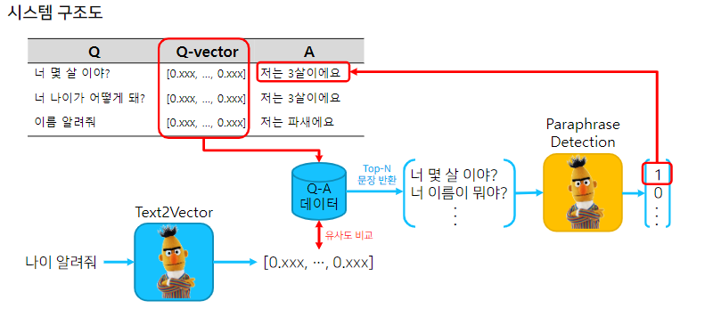

# 6강 BERT 기반 두 문장 관계 분류 모델 학습

3강에서 배운 BERT를 가지고 자연어 처리 Task를 해결해 봅니다. 🥴

두 문장 관례 분류 모델 학습은 주어진 두 문장에 대하여 두 문장에 대한 라벨을 예측하는 것입니다.

5강의 단일 문장 분류 모델과의 가장 큰 차이점은 Input 문장의 개수입니다.

두 문장 관계 분류 모델에서는 2개의 문장을 받아 그 문장들의 관계에 해당하는 라벨을 예측합니다.😚

<details open="open">
  <summary>Table of Contents</summary>
  <ol>
    <li>
      <a href="#두-문장-관계-분류-task-소개">두 문장 관계 분류 task 소개</a>
      <ul>
        <li><a href="#task-소개">task 소개</a></li>
        <li><a href="#두-문장-관계-분류를-위한-데이터">두 문장 관계 분류를 위한 데이터</a></li>
      </ul>
    </li>
    <li>
      <a href="#모델-학습-실습">모델 학습 실습</a>
      <ul>
        <li><a href="#21-information-retrieval-question-and-answering-irqa">Information Retrieval Question and Answering (IRQA)</a></li>
        <li><a href="#두-문장-관계-분류를-위한-학습-데이터-구축">두 문장 관계 분류를 위한 학습 데이터 구축</a></li>
        <li><a href="#두-문장-관계-분류-학습">두 문장 관계 분류 학습</a></li>
        <li><a href="#bert-irqa-기반의-챗봇-실습">BERT IRQA 기반의 챗봇 실습</a></li>
      </ul>
    </li>
  </ol>
</details>

## 1. 두 문장 관계 분류 task 소개

### 1.1 task 소개
- 주어진 2개의 문장에 대해 두 문장의 자연어 추론과 의미론적인 유사성을 측정하는 task



<br/>
<div align="right">
    <b><a href="#6강-bert-기반-두-문장-관계-분류-모델-학습">↥ back to top</a></b>
</div>
<br/>

### 두 문장 관계 분류를 위한 데이터
- Natural Language Processing (NLI)
    - premise와 hypothesis가 주어짐
    - entailment(함의), contradiction(모순), neutral(중립)으로 분류


- Semantic text pair
    - 두 문장의 의미가 서로 같은 문장인지 검증



<br/>
<div align="right">
    <b><a href="#6강-bert-기반-두-문장-관계-분류-모델-학습">↥ back to top</a></b>
</div>
<br/>

## 2. 모델 학습 실습

BERT로 IRQA 챗봇을 만들어봅시다!

### 2.1 Information Retrieval Question and Answering (IRQA)



<br/>
<div align="right">
    <b><a href="#6강-bert-기반-두-문장-관계-분류-모델-학습">↥ back to top</a></b>
</div>
<br/>

### 두 문장 관계 분류를 위한 학습 데이터 구축

- 조원익님 제작
- 한 문장에 대해 10개의 paraphrasing된 pair가 존재

```python
$ git clone https://github.com/warnikchow/paraKQC.git
```

- 관계 분류를 위해 1개에 9개 연관 sentence로 묶음
- 접근방법: 나머지 문장에서 random하게 뽑는 것이 아니라 나머지 문장을 미리 sentence embedding으로 계산해두고
- 이 중 가장 유사도가 높게 나오는 문장을 선택
- 이러면 모델 입장에선 비슷하나 의미론적으론 다른 sample이 뽑힘

```python
# 굉장히 유용한 함수
def get_cls_token(sent_A):
    model.eval()
    tokenized_sent = tokenizer(
            sent_A,
            return_tensors="pt",
            truncation=True,
            add_special_tokens=True,
            max_length=32
    ).to('cuda:0')
    with torch.no_grad():# 그라디엔트 계산 비활성화
        outputs = model(
            input_ids=tokenized_sent['input_ids'],
            attention_mask=tokenized_sent['attention_mask'],
            token_type_ids=tokenized_sent['token_type_ids']
            )
    logits = outputs.last_hidden_state[:,0,:].detach().cpu().numpy()
    return logits
```

- 키워드는 비슷하지만 의미론적으로 유사한 것들을 가져오게 된다.

```python
메일을 다 비울까 아니면 안읽은 것만 지울까?
- ('안방 말고 지금 거실 온도 좀 볼 수 있을까?', array([[0.98267]], dtype=float32))
- ('안 읽은 메일함이랑 스팸 메일함이랑 비교했을 때 어디가 더 차있지?', array([[0.97837853]], dtype=float32))
- ('가습기가 필요한게 아니고 제습기 하나 사야될 것 같지 않아?', array([[0.97624516]], dtype=float32))
- ('일월이 바쁘신가요, 아니면 이월이 더 바쁘신가요?', array([[0.97588336]], dtype=float32))
- ('안방하고 거실 중에 너가 로봇청소기를 틀고 싶은 곳은 어딜까?', array([[0.97562]], dtype=float32))
- ('안방 말고 거실 온도 보려면 어떻게 말해야하나?', array([[0.97547626]], dtype=float32))
- ('지금 네가 하고 싶은게 외출모드일까 아님 방범모드일까?', array([[0.9754139]], dtype=float32))
- ('메일을 상사에게 어떻게 보내야해?', array([[0.9753622]], dtype=float32))
- ('안방 말고 거실 지금 온도 보려면 뭐라고 해야해?', array([[0.9751789]], dtype=float32))
- ('목욕물을 개인별로 세팅하고 싶은데요 어떻게 하면 좋을까요?', array([[0.97513217]], dtype=float32))

지메일 쓸래, 네이버 메일 쓸래
- ('한메일 계정은 그만 만들고 네이버 계정으로 만들어', array([[0.9531825]], dtype=float32))
- ('참조 메일주소는 모으지 않아도 돼. 보낸 사람 중에서 특수문자가 있는 메일주소만 모아줘.', array([[0.9495812]], dtype=float32))
- ('모니터말고 빔프로젝터로 영화 띄워서 보자', array([[0.9486408]], dtype=float32))
- ('아웃룩 외부 연동 메일이 세개 이상이 되지 않도록 연동 개수를 확인하고, 세개 이상인 경우 두개로 줄이시기 바랍니다.', array([[0.94794756]], dtype=float32))
- ('usb로 파일을 전달하지 말고 네이버 메일로 보내', array([[0.94788885]], dtype=float32))
- ('파일 전송은 지메일 보단 네이버 메일을 사용해', array([[0.9477933]], dtype=float32))
- ('메일을 지울 때 첨부파일 용량이 작은 메일은 남겨두고, 큰 메일은 전부 지우는게 좋아.', array([[0.9470954]], dtype=float32))
- ('다른 이메일을 사용해. 지메일은 안돼', array([[0.9469803]], dtype=float32))
- ('리눅스에서 제공하는 메일관리 기능과 윈도우에서 제공하는 메일 관리 기능 중 뭐가 더 편했니?', array([[0.9469311]], dtype=float32))
- ('아웃룩은 리눅스가 아닌 운영체제에서 이용하길 바래', array([[0.94628114]], dtype=float32))
```

<br/>
<div align="right">
    <b><a href="#6강-bert-기반-두-문장-관계-분류-모델-학습">↥ back to top</a></b>
</div>
<br/>

### 두 문장 관계 분류 학습
- 80:20으로 학습 처리!
- train: 15170, dev: 3752
- Dataset 준비 부분 아이디어가 너무 좋았음
- 분류는 그냥 Single Sentence와 다를 바 없음

<br/>
<div align="right">
    <b><a href="#6강-bert-기반-두-문장-관계-분류-모델-학습">↥ back to top</a></b>
</div>
<br/>

### BERT IRQA 기반의 챗봇 실습
- 위에서 학습한 모델로 챗봇 실습

```python
$ git clone https://github.com/songys/Chatbot_data.git
data.head()
```
|   |                         Q |                   A | label |
|--:|--------------------------:|--------------------:|------:|
| 0 |                  12시 땡! |   하루가 또 가네요. |     0 |
| 1 |       1지망 학교 떨어졌어 |    위로해 드립니다. |     0 |
| 2 |      3박4일 놀러가고 싶다 | 여행은 언제나 좋죠. |     0 |
| 3 | 3박4일 정도 놀러가고 싶다 | 여행은 언제나 좋죠. |     0 |
| 4 |                PPL 심하네 |  눈살이 찌푸려지죠. |     0 |

- Top n개의 문장을 뽑을 것임

```python
chatbot_Question = data['Q'].values
chatbot_Answer = data['A'].values
print(chatbot_Question)
print(chatbot_Answer)
print(len(chatbot_Question), len(chatbot_Answer))
```
```
['12시 땡!' '1지망 학교 떨어졌어' '3박4일 놀러가고 싶다' ... '흑기사 해주는 짝남.'
 '힘든 연애 좋은 연애라는게 무슨 차이일까?' '힘들어서 결혼할까봐']
['하루가 또 가네요.' '위로해 드립니다.' '여행은 언제나 좋죠.' ... '설렜겠어요.'
 '잘 헤어질 수 있는 사이 여부인 거 같아요.' '도피성 결혼은 하지 않길 바라요.']
11823 11823
```

- 우선 전체 질문에 대한 vector 정보를 저장
    - `bert-base-multilingual-cased` 로 유사도 획득

```python
def get_cls_token(sent_A):
    model.eval()
    tokenized_sent = tokenizer(
            sent_A,
            return_tensors="pt",
            truncation=True,
            add_special_tokens=True,
            max_length=32
    ).to(device)
    with torch.no_grad():# 그라디엔트 계산 비활성화
        outputs = model(
            input_ids=tokenized_sent['input_ids'],
            attention_mask=tokenized_sent['attention_mask'],
            token_type_ids=tokenized_sent['token_type_ids']
            )
    logits = outputs.last_hidden_state[:,0,:].detach().cpu().numpy()
    return logits


chatbot_Question_vectors = {}
for i, question in enumerate(chatbot_Question):
    chatbot_Question_vectors[i] = get_cls_token(question)
```

- 전체 질문과 유사도를 검사해서 top-n개를 반환하는 코드 작성

```python
def custom_cosine_similarity(a,b):
    numerator = np.dot(a,b.T)
    a_norm = np.sqrt(np.sum(a * a))
    b_norm = np.sqrt(np.sum(b * b, axis=-1))

    denominator = a_norm * b_norm
    return numerator/denominator


def return_top_n_idx(question, n):
    question_vector = get_cls_token(question)
    sentence_similarity = {}
    for i in chatbot_Question_vectors.keys():
        ir_vector = chatbot_Question_vectors[i]
        similarity = custom_cosine_similarity(question_vector, ir_vector)
        sentence_similarity[i] = similarity

    sorted_sim = sorted(sentence_similarity.items(), key=lambda x: x[1], reverse=True)
    return sorted_sim[0:n]


# top 5개 question id를 반환
print(return_top_n_idx("오늘 너무 힘들어", 5))
```
```
[(3285, array([[0.97600377]], dtype=float32)), (7121, array([[0.9664848]], dtype=float32)), (5947, array([[0.9598295]], dtype=float32)), (5959, array([[0.95737875]], dtype=float32)), (7176, array([[0.9529198]], dtype=float32))]
```

- 위의 Question ID로 `오늘 너무 힘들어`와 가장 가까운 Q와 A를 출력

```python
print('most similar questions')
for result in return_top_n_idx("오늘 너무 힘들어", 5):
    print(chatbot_Question[result[0]])
print('\nmost similar answers')
for result in return_top_n_idx("오늘 너무 힘들어", 5):
    print(chatbot_Answer[result[0]])
```
```
most similar questions
오늘 너무 힘들다
오늘 너무 힘드네
너무 힘들어
너무나도 힘들어
오늘따라 너무 힘드네

most similar answers
고생 많았어요.
오늘은 힘내려 하지 말아요. 저에게 기대세요.
지금 무슨 말을 해도 와닿지 않겠지만 잘할 수 있을 거예요.
억지로라도 긍정적인 생각을 해보세요.
힘든 날이네요.
```

- Top 1의 결과가 정답이 아닌 경우가 있음
    - 너 누구야? 힘들 때 같이 있는 거요 ㅎ
    - 말이 안되죠?

```
Q: 너 이름이 뭐야?

==== Most Similar Questions ====
우정이 뭐야?
너 뭐니?
할 줄 아는거 뭐야?
사랑의 끝이 뭐야?
너 누구?

==== Most Similar Answers ====
힘들 때 같이 있는 거요.
저는 위로봇입니다.
당신의 삶을 응원해 드릴 수 있어요라고 감히 말해 봅니다.
사랑하지 않는 것이죠.
저는 마음을 이어주는 위로봇입니다.
```

- 앞선 예제에서 학습한 BERT 분류 모델을 load 후 위에서 유사하다고 판단된 결과를 분류
    - 0: "non_similar", 1: "similar"

```
print(sentences_predict('오늘 날씨가 어때요?','오늘의 날씨를 알려줘')) # similar
print(sentences_predict('오늘 날씨가 어때요?','기분 진짜 안좋다.')) # non_similar
print(sentences_predict('오늘 날씨가 어때요?','오늘 기분 어떠세요?')) # non_similar
print(sentences_predict('오늘 날씨가 어때요?','오늘 기분이 어때요?')) # non_similar
print(sentences_predict('오늘 날씨가 어때요?','지금 날씨가 어때요?')) # non_similar
print(sentences_predict('무협 소설 추천해주세요.','무협 장르의 소설 추천 부탁드립니다.')) # similar
print(sentences_predict('무협 소설 추천해주세요.','판타지 소설 추천해주세요.')) # non_similar
print(sentences_predict('무협 소설 추천해주세요.','무협 느낌나는 소설 하나 추천해주실 수 있으실까요?')) # similar
print(sentences_predict('메난민이 뭐야','너 메난민이지?')) # similar
```

- 챗봇 구현!

```python
def get_answer(question, n):
    results = return_top_n_idx(question, n) # top n개를 list로 받고
    for result in results:  # n개를 반복문을 돌면서
        ir_answer = chatbot_Answer[result[0]]
        ir_question = chatbot_Question[result[0]]
        if sentences_predict(question, ir_question) == 1:   # 이진분류 모델이 query<->question의 의미가 서로 같다고 판단되면?
            return ir_answer    # 정답을 반환합니다.
    return chatbot_Answer[results[0][0]]    # "잘 모르겠어요."
```

<br/>
<div align="right">
    <b><a href="#6강-bert-기반-두-문장-관계-분류-모델-학습">↥ back to top</a></b>
</div>
<br/>
