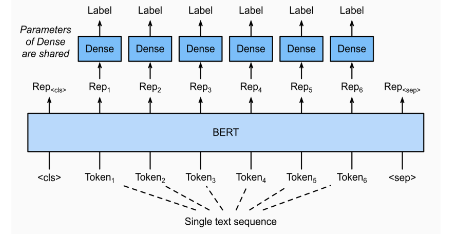
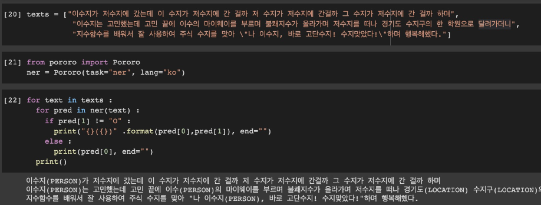
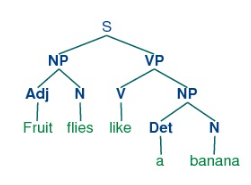

# 7강 BERT 언어모델 기반의 문장 토큰 분류

[back to super](https://github.com/jinmang2/boostcamp_ai_tech_2/tree/main/p-stage/klue_re)

<details open="open">
  <summary>Table of Contents</summary>
  <ol>
    <li>
      <a href="#71-문장-토큰-분류-task-소개">문장 토큰 분류 task 소개</a>
      <ul>
        <li><a href="#11-task-소개">task-소개</a></li>
        <li><a href="#12-문장-token-분류를-위한-데이터">문장 token 분류를 위한 데이터</a></li>
      </ul>
    </li>
    <li>
      <a href="#72-문장-토큰-분류-모델-학습">문장 토큰 분류 모델 학습 실습</a>
      <ul>
        <li><a href="#21-문장-토큰-분류-모델-학습">문장 토큰 분류 모델 학습</a></li>
        <li><a href="#문장-토큰-단위-분류-모델-학습">문장 토큰 단위 분류 모델 학습</a></li>
        <li><a href="#기계-독해-모델-학습">기계 독해 모델 학습</a></li>
      </ul>
    </li>
    <li><a href="#reference">Reference</a></li>
  </ol>
</details>

## 1. 문장 토큰 분류 task 소개

### 1.1 task 소개

- 주어진 문장의 각 token이 어떤 범주에 속하는지 분류하는 task



#### NER (Named Entity Recognition)
- 개체명 인식은 문맥을 파악해서 인명, 기관명, 지명 등과 같은 문장 또는 문서에서 특정한 의미를 가지고 있는 단어, 또는 어구(개체) 등을 인식하는 과정을 의미한다


- 같은 단어라도 문맥에서 다양한 개체(Entity)로 사용



#### POS (Part-of-speech tagging)
- 품사란 단어를 문법적 성질의 공통성에 따라 언어학자들이 몇 갈래로 묶어 놓은 것
- 품사 태깅은 주어진 문장의 각 성분에 대하여 가장 알맞는 품사를 태깅하는 것을 의미



```
from pororo import Pororo
pos = Pororo(task="pos", lang="ko")
pos("이순신은 조선 중기의 무신이다.")
```

<br/>
<div align="right">
    <b><a href="#7강-bert-언어모델-기반의-문장-토큰-분류">↥ back to top</a></b>
</div>
<br/>

### 1.2 문장 token 분류를 위한 데이터

#### kor_ner
- 한국해양대학교 자연어 처리 연구실에서 공개한 한국어 NER 데이터셋
- 일반적으로, NER 데이터셋은 pos tagging도 함께 존재


- Entity tag에서 B의 의미는 개체명의 시작(Begin)을 의미하고, I의 의미는 내부(Inside)를 의미하며, O는 다루지 않는 개체명(Object)를 의미
- 즉, B-PER은 인물명 개체명의 시작을 의미
- I-PER은 인물명 개체명의 내부 부분을 믜미
- kor_ner 데이터셋의 개체명은 아래와 같음


<br/>
<div align="right">
    <b><a href="#7강-bert-언어모델-기반의-문장-토큰-분류">↥ back to top</a></b>
</div>
<br/>


## 2. 문장 토큰 분류 모델 학습 실습

### 2.1 문장 토큰 분류 모델 학습
- 주의할 점! 형태소 단위의 토큰을 음절 단위의 토큰으로 분해하고, Entity tag 역시 음절 단위로 매핑시켜 주어야 한다


### 문장 토큰 단위 분류 모델 학습

```python
$ git clone https://github.com/kmounlp/NER.git

import os
import glob

file_list = []
for x in os.walk('/content/NER/'):
    for y in glob.glob(os.path.join(x[0], '*_NER.txt')):    # ner.*, *_NER.txt
        file_list.append(y)
file_list = sorted(file_list)
```
```
/content/NER/말뭉치 - 형태소_개체명/00002_NER.txt
/content/NER/말뭉치 - 형태소_개체명/00003_NER.txt
/content/NER/말뭉치 - 형태소_개체명/00004_NER.txt
...
/content/NER/말뭉치 - 형태소_개체명/32765_NER.txt
/content/NER/말뭉치 - 형태소_개체명/32766_NER.txt
/content/NER/말뭉치 - 형태소_개체명/32767_NER.txt
```

- Data Sample
    - 나눠져있는 문장을 합치고 토큰 별 tag를 label로 만들어 줘야 한다.

```python
from pathlib import Path

file_path = file_list[0]
file_path = Path(file_path)
raw_text = file_path.read_text().strip()
print(raw_text)
```
```
## 1
## 오에 겐자부로는 일본 현대문학의 초석을 놓은 것으로 평가받는 작가 나쓰메 소세키(1867~1916)의 대표작 ‘마음’에 담긴 군국주의적 요소, 야스쿠니 신사 참배 행위까지 소설의 삽화로 동원하며 일본 사회의 ‘비정상성’을 문제 삼는다.
## <오에 겐자부로:PER>는 <일본:LOC> 현대문학의 초석을 놓은 것으로 평가받는 작가 <나쓰메 소세키:PER>(<1867~1916:DUR>)의 대표작 ‘<마음:POH>’에 담긴 군국주의적 요소, <야스쿠니 신사:ORG> 참배 행위까지 소설의 삽화로 동원하며 <일본:ORG> 사회의 ‘비정상성’을 문제 삼는다.
오에	오에	NNG	B-PER
_	_	_	I-PER
겐자부로	겐자부로	NNP	I-PER
는	는	JX	O
_	_	_	O
일본	일본	NNP	B-LOC
_	_	_	O
현대	현대	NNG	O
문학	문학	NNG	O
의	의	JKG	O
_	_	_	O
초석	초석	NNG	O
을	을	JKO	O
_	_	_	O
놓	놓	VV	O
은	은	ETM	O
_	_	_	O
것	것	NNB	O
으로	으로	JKB	O
_	_	_	O
평가	평가	NNG	O
받	받	VV	O
는	는	ETM	O
_	_	_	O
작가	작가	NNG	O
_	_	_	O
나쓰메	나쓰메	NNP	B-PER
_	_	_	I-PER
소세키	소세키	NNP	I-PER
(	(	SS	O
1867	1867	SN	B-DUR
~	~	SO	I-DUR
1916	1916	SN	I-DUR
...
```

- 데이터 셋 전처리

```python
def read_file(file_list):
    ...
    # 파일 순회
    for file_path in file_list:
        ...
        raw_text = file_path.read_text().strip()
        raw_docs = re.split(r'\n\t?\n', raw_text)
        # docs 별로
        for doc in raw_docs:
            ...
            for line in doc.split('\n'):
                if line[0:1] == "$" or line[0:1] == ";" or line[0:2] == "##":
                    continue
                try:
                    token = line.split('\t')[0]
                    tag = line.split('\t')[3]   # 2: pos, 3: ner
                    for i, syllable in enumerate(token):    # 음절 단위로 잘라서
                        tokens.append(syllable)
                        modi_tag = tag
                        if i > 0:
                            if tag[0] == 'B':
                                modi_tag = 'I' + tag[1:]    # BIO tag를 부착할게요 :-)
                        tags.append(modi_tag)
                except:
                    print(line)
            ...
    return token_docs, tag_docs


texts, tags = read_file(file_list[:])
print(texts[0], end='\n\n') # 음절 단위로 잘 잘렸네요!
print(tags[0])
```
```
['오', '에', '_', '겐', '자', '부', '로', '는', '_', '일', '본', '_', '현', '대', '문', '학', '의', '_', '초', '석', '을', '_', '놓', '은', '_', '것', '으', '로', '_', '평', '가', '받', '는', '_', '작', '가', '_', '나', '쓰', '메', '_', '소', '세', '키', '(', '1', '8', '6', '7', '~', '1', '9', '1', '6', ')', '의', '_', '대', '표', '작', '_', '‘', '마', '음', '’', '에', '_', '담', '긴', '_', '군', '국', '주', '의', '적', '_', '요', '소', ',', '_', '야', '스', '쿠', '니', '_', '신', '사', '_', '참', '배', '_', '행', '위', '까', '지', '_', '소', '설', '의', '_', '삽', '화', '로', '_', '동', '원', '하', '며', '_', '일', '본', '_', '사', '회', '의', '_', '‘', '비', '정', '상', '성', '’', '을', '_', '문', '제', '_', '삼', '는', '다', '.']

['B-PER', 'I-PER', 'I-PER', 'I-PER', 'I-PER', 'I-PER', 'I-PER', 'O', 'O', 'B-LOC', 'I-LOC', 'O', 'O', 'O', 'O', 'O', 'O', 'O', 'O', 'O', 'O', 'O', 'O', 'O', 'O', 'O', 'O', 'O', 'O', 'O', 'O', 'O', 'O', 'O', 'O', 'O', 'O', 'B-PER', 'I-PER', 'I-PER', 'I-PER', 'I-PER', 'I-PER', 'I-PER', 'O', 'B-DUR', 'I-DUR', 'I-DUR', 'I-DUR', 'I-DUR', 'I-DUR', 'I-DUR', 'I-DUR', 'I-DUR', 'O', 'O', 'O', 'O', 'O', 'O', 'O', 'O', 'B-POH', 'I-POH', 'O', 'O', 'O', 'O', 'O', 'O', 'O', 'O', 'O', 'O', 'O', 'O', 'O', 'O', 'O', 'O', 'B-ORG', 'I-ORG', 'I-ORG', 'I-ORG', 'I-ORG', 'I-ORG', 'I-ORG', 'O', 'O', 'O', 'O', 'O', 'O', 'O', 'O', 'O', 'O', 'O', 'O', 'O', 'O', 'O', 'O', 'O', 'O', 'O', 'O', 'O', 'O', 'B-ORG', 'I-ORG', 'O', 'O', 'O', 'O', 'O', 'O', 'O', 'O', 'O', 'O', 'O', 'O', 'O', 'O', 'O', 'O', 'O', 'O', 'O', 'O']
```

- 학습을 위해 tag들을 숫자로 변환

```python
unique_tags = set(tag for doc in tags for tag in doc)
tag2id = {tag: id for id, tag in enumerate(unique_tags)}
id2tag = {id: tag for tag, id in tag2id.items()}
```

- 각 NER 태그별 데이터에 포함된 갯수

```
I-ORG :  41,320
    O : 983,746
B-ORG :  13,089
B-DAT :   5,383
B-PNT :   1,672
B-TIM :     371
B-POH :   6,686
I-DUR :   4,573
I-PNT :   4,613
I-NOH :  23,967
I-PER :  26,206
B-NOH :  11,051
I-MNY :   6,930
I-DAT :  14,433
B-LOC :   6,313
B-PER :  13,779
I-POH :  37,156
I-TIM :   1,876
B-DUR :   1,207
I-LOC :  16,537
B-MNY :   1,440
```

- Train:Test 비율은 8:2
- `MODEL_NAME = "bert-base-multilingual-cased"`
- special tokens

```python
pad_token_id = tokenizer.pad_token_id # 0
cls_token_id = tokenizer.cls_token_id # 101
sep_token_id = tokenizer.sep_token_id # 102
pad_token_label_id = tag2id['O']    # tag2id['O']
cls_token_label_id = tag2id['O']
sep_token_label_id = tag2id['O']
```

- Char-based tokenizer
    - 모델별로 다름! token들이 어떻게 정의되어 있나 확인 잘 하기

```python
def ner_tokenizer(sent, max_seq_length):    
    pre_syllable = "_"
    input_ids = [pad_token_id] * (max_seq_length - 1)
    attention_mask = [0] * (max_seq_length - 1)
    token_type_ids = [0] * max_seq_length
    sent = sent[:max_seq_length-2]

    for i, syllable in enumerate(sent):
        if syllable == '_':
            pre_syllable = syllable
        if pre_syllable != "_":
            syllable = '##' + syllable  # 중간 음절에는 모두 prefix를 붙입니다.
            # 이순신은 조선 -> [이, ##순, ##신, ##은, 조, ##선]
        pre_syllable = syllable

        input_ids[i] = (tokenizer.convert_tokens_to_ids(syllable))
        attention_mask[i] = 1

    input_ids = [cls_token_id] + input_ids
    input_ids[len(sent)+1] = sep_token_id
    attention_mask = [1] + attention_mask
    attention_mask[len(sent)+1] = 1
    return {"input_ids":input_ids,
            "attention_mask":attention_mask,
            "token_type_ids":token_type_ids}
```

- training label 제작

```python
def encode_tags(tags, max_seq_length, pad_token_id=1):
    tags = tags[:max_seq_length-2]
    labels = [tag2id['O']] + [tag2id[tag] for tag in tags]

    padding_length = max_seq_length - len(labels)
    labels = labels + ([pad_token_id] * padding_length)

    return labels
```

- 모델 호출

```python
model = BertForTokenClassification.from_pretrained(
    MODEL_NAME,
    num_labels=len(unique_tags)
 )
```

- New Data Inference

```python
def ner_inference(text) :

    model.eval()
    text = text.replace(' ', '_')

    predictions , true_labels = [], []

    tokenized_sent = ner_tokenizer(text, len(text)+2)
    input_ids = torch.tensor(tokenized_sent['input_ids']).unsqueeze(0).to(device)
    attention_mask = torch.tensor(tokenized_sent['attention_mask']).unsqueeze(0).to(device)
    token_type_ids = torch.tensor(tokenized_sent['token_type_ids']).unsqueeze(0).to(device)    

    with torch.no_grad():
        outputs = model(
            input_ids=input_ids,
            attention_mask=attention_mask,
            token_type_ids=token_type_ids)

    logits = outputs['logits']
    logits = logits.detach().cpu().numpy()
    label_ids = token_type_ids.cpu().numpy()

    predictions.extend([list(p) for p in np.argmax(logits, axis=2)])
    true_labels.append(label_ids)

    pred_tags = [list(tag2id.keys())[p_i] for p in predictions for p_i in p]

    print('{}\t{}'.format("TOKEN", "TAG"))
    print("===========")
    # for token, tag in zip(tokenizer.decode(tokenized_sent['input_ids']), pred_tags):
    #   print("{:^5}\t{:^5}".format(token, tag))
    for i, tag in enumerate(pred_tags):
        print("{:^5}\t{:^5}".format(tokenizer.convert_ids_to_tokens(tokenized_sent['input_ids'][i]), tag))


text = '이순신은 조선 중기의 무신이다.'
ner_inference(text)
```
```
TOKEN	TAG
===========
[CLS]	  O  
  이  	B-PER
 ##순 	I-PER
 ##신 	I-PER
 ##은 	  O  
  _  	  O  
  조  	  O  
 ##선 	  O  
  _  	  O  
  중  	  O  
 ##기 	  O  
 ##의 	  O  
  _  	  O  
  무  	  O  
 ##신 	  O  
 ##이 	  O  
 ##다 	  O  
 ##. 	  O  
[SEP]	  O  
```
<br/>
<div align="right">
    <b><a href="#7강-bert-언어모델-기반의-문장-토큰-분류">↥ back to top</a></b>
</div>
<br/>


### 기계 독해 모델 학습

- Dataset Download

```python
!wget https://korquad.github.io/dataset/KorQuAD_v1.0_train.json
!wget https://korquad.github.io/dataset/KorQuAD_v1.0_dev.json
```

- Dataset Parsing

```python
# 데이터셋을 파싱해오겠습니다 :-)

import json
from pathlib import Path

def read_squad(path):
    path = Path(path)
    with open(path, 'rb') as f:
        squad_dict = json.load(f)

    contexts = []
    questions = []
    answers = []
    for group in squad_dict['data']:
        for passage in group['paragraphs']:
            context = passage['context']
            for qa in passage['qas']:
                question = qa['question']
                for answer in qa['answers']:
                    contexts.append(context)
                    questions.append(question)
                    answers.append(answer)

    return contexts, questions, answers


train_contexts, train_questions, train_answers = read_squad('dataset/KorQuAD_v1.0_train.json')
val_contexts, val_questions, val_answers = read_squad('dataset/KorQuAD_v1.0_dev.json')
```
```
Context
===================================================
사우스런던 브릭스톤 태생 보위는 어릴 적 음악에 대한 관심을 키워왔으며, 결국에는 예술, 음악, 디자인을 배워 전문적인 음악가 경력을 1963년부터 착수했다.
〈Space Oddity〉는 1969년 7월 발표 뒤 영국 음반 차트에서
상위 5위에 오른 그의 첫 싱글이다.
실험 활동을 거친 그는 1972년 음악을 재개, 자신의 글램록 시기 동안 이색적이고 양성적인 제2의 자아인 지기 스타더스트로 활동을 이어나갔다.
성공을 거둔 싱글 〈Starman〉과 전 세계적인 인기를 끈 음반 《The Rise and Fall of Ziggy Stardust and the Spiders from Mars》으로 캐릭터를 내세운 보위는 1975년 "플라스틱 솔"을 캐릭터화시켜 자신을 철저히 바꾼다.
이 행동은 당초 영국에서 그의 열혈팬의 반발을 샀으나 미국에서는 싱글 〈Fame〉과 음반 《Young Americans》을 통해 처음으로 메이저한 성공을 거두게 된다.
1976년 보위는 컬트 영화 《지구에 떨어진 사나이》에 출연하고 음반 《Station to Station》을 발표한다.
이듬해에는 일렉트릭 음악을 접목한 음반 《Low》 (1977)을 발표하면서 음악적 예상을 깨뜨렸다.
이 음반은 브라이언 이노와의 세 번의 협업 중 첫 번째로 이는 이후 "베를린 삼부작"으로 일컬어진다.
뒤를 이어 발표된 《"Heroes"》 (1977)와 《Lodger》 (1979)는 영국 차트 상위 5위에 진입, 지속적인 극찬을 받았다.

Question
===================================================
보위가 1977년 일렉트릭 음악을 접목하여 발표한 음반은?

Answer
===================================================
{'text': 'Low', 'answer_start': 568}
```

- Add end idx
    - answer의 길이로 get

```python
def add_end_idx(answers, contexts):
    for answer, context in zip(answers, contexts):
        # 모델 학습을 위해 정답 데이터를 만들겠습니다.
        # 정답 데이터는 start음절과 end 음절로 구성되어 있습니다.
        # 모델은 전체 토큰 중에서 start token과 end token을 찾아내는 것을 목표로 학습하게 됩니다.
        gold_text = answer['text']
        start_idx = answer['answer_start']
        end_idx = start_idx + len(gold_text)


        # sometimes squad answers are off by a character or two – fix this
        # 실제 본문에서 해당 음절 번호로 잘라냈을 때, 정답과 같은지 검사해서 start, end를 보정합니다 :-)
        # '이순신은 조선 중기의 무신이다' -> '이순신' -> start: 0, end: 4
        if context[start_idx:end_idx] == gold_text:
            answer['answer_end'] = end_idx
        elif context[start_idx-1:end_idx-1] == gold_text:
            answer['answer_start'] = start_idx - 1
            answer['answer_end'] = end_idx - 1     # When the gold label is off by one character
        elif context[start_idx-2:end_idx-2] == gold_text:
            answer['answer_start'] = start_idx - 2
            answer['answer_end'] = end_idx - 2     # When the gold label is off by two characters
    return answers

train_answers = add_end_idx(train_answers, train_contexts)
val_answers = add_end_idx(val_answers, val_contexts)
```

- Token position 추가

```python
def add_token_positions(encodings, answers):
    start_positions = []
    end_positions = []
    # 이제 음절 index를 token index와 mapping하는 작업을 해보도록 하겠습니다 :-)
    for i in range(len(answers)):
        # tokenizer의 char_to_token 함수를 호출하면 음절 숫자를 token index로 바꿔줄 수 있습니다.
        start_positions.append(encodings.char_to_token(i, answers[i]['answer_start']))
        end_positions.append(encodings.char_to_token(i, answers[i]['answer_end']))
        # 아래 부분은 truncation을 위한 과정입니다.
        # if start position is None, the answer passage has been truncated
        if start_positions[-1] is None:
            start_positions[-1] = tokenizer.model_max_length

        # if end position is None, the 'char_to_token' function points to the space before the correct token - > add + 1
        if end_positions[-1] is None:
            end_positions[-1] = encodings.char_to_token(i, answers[i]['answer_end'] + 1)

        # 추가된 예외 처리, 예를들어서 tokenizer와 model input의 max_length가 512인데, start와 end position이 600과 610 이면 둘다 max_length로 변경해야함.
        # 어차피 max_length가 512인 모델은 정답을 볼 수 없음.
        if start_positions[-1] is None or start_positions[-1] > tokenizer.model_max_length:
            start_positions[-1] = tokenizer.model_max_length

        if end_positions[-1] is None or end_positions[-1] > tokenizer.model_max_length:
            end_positions[-1] = tokenizer.model_max_length

    encodings.update({'start_positions': start_positions, 'end_positions': end_positions})
    return encodings

train_encodings = add_token_positions(train_encodings, train_answers)
val_encodings = add_token_positions(val_encodings, val_answers)
```

- 모델 호출 및 학습

```python
model = BertForQuestionAnswering.from_pretrained(MODEL_NAME)
model.to(device)

trainer = Trainer(
    model=model,                         # the instantiated 🤗 Transformers model to be trained
    args=training_args,                  # training arguments, defined above
    train_dataset=train_dataset,         # training dataset
    eval_dataset=val_dataset            # evaluation dataset
)
```

- 결과 확인

```python
nlp = pipeline("question-answering", model=model, tokenizer=tokenizer, device=0)

context = r"""
이순신(李舜臣, 1545년 4월 28일 ~ 1598년 12월 16일 (음력 11월 19일))은 조선 중기의 무신이었다.
본관은 덕수(德水), 자는 여해(汝諧), 시호는 충무(忠武)였으며, 한성 출신이었다.
문반 가문 출신으로 1576년(선조 9년) 무과(武科)에 급제하여 그 관직이 동구비보 권관, 훈련원 봉사, 발포진 수군만호, 조산보 만호, 전라좌도 수군절도사를 거쳐 정헌대부 삼도수군통제사에 이르렀다.
"""

print(nlp(question="이순신이 태어난 날짜는?", context=context))
print(nlp(question="이순신의 본관은?", context=context))
print(nlp(question="이순신의 시호는?", context=context))
print(nlp(question="이순신의 고향은?", context=context))
print(nlp(question="이순신의 마지막 직책은?", context=context))
```
```
{'score': 0.1287170797586441, 'start': 25, 'end': 40, 'answer': '1598년 12월 16일 ('}
{'score': 0.5768629908561707, 'start': 72, 'end': 75, 'answer': '덕수('}
{'score': 0.4932706952095032, 'start': 95, 'end': 98, 'answer': '충무('}
{'score': 0.1482970416545868, 'start': 106, 'end': 114, 'answer': '한성 출신이었다'}
{'score': 0.038699887692928314, 'start': 214, 'end': 222, 'answer': '삼도수군통제사에'}
```

<br/>
<div align="right">
    <b><a href="#7강-bert-언어모델-기반의-문장-토큰-분류">↥ back to top</a></b>
</div>
<br/>

## Reference
개체명 인식
- [Named Entity Recognition (NER) for Turkish with BERT](https://medium.com/analytics-vidhya/named-entity-recognition-for-turkish-with-bert-f8ec04a31b0)

QA
- [lonformer_qa_training.ipynb](https://github.com/patil-suraj/Notebooks/blob/master/longformer_qa_training.ipynb)
- [Retrieval-Augmented Generation for Knowledge-Intensive NLP Tasks ](https://jeonsworld.github.io/NLP/rag/)

BERT seq2seq
- [BERT2BERT_for_CNN_Dailymail.ipynb](https://github.com/patrickvonplaten/notebooks/blob/master/BERT2BERT_for_CNN_Dailymail.ipynb)
- [Bert2Bert Summarization](https://github.com/MrBananaHuman/bert2bert-summarization)


```python

```

[link]()


<br/>
<div align="right">
    <b><a href="#7강-bert-언어모델-기반의-문장-토큰-분류">↥ back to top</a></b>
</div>
<br/>
