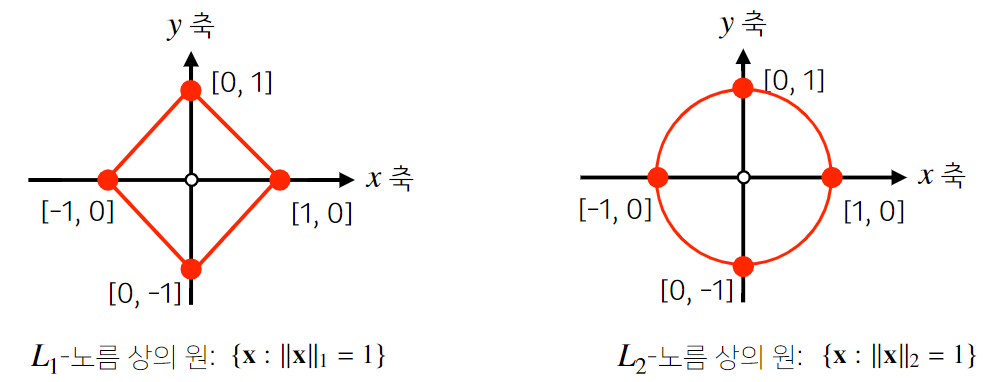

# 1강 벡터가 뭐에요?
**벡터의 기본 개념과 연산**, **노름**에 대해 소개
**두 벡터 사이의 거리와 각도**, 그리고 **내적**에 대해 설명

- 벡터는 숫자를 원소로 가지는 리스트(list) 혹은 배열(array)
    - 보통은 열벡터로 표현하나, numpy에선 행벡터로 나타낸다는 사실 유의하자.
```python
x = [1, 7, 2]
x = np.array([1, 7, 2])
```

- 보통 아래와 같은 notation으로 표현한다 (열벡터로 표현)
$$x=\begin{bmatrix}
x_1\\
x_2\\
\vdots\\
x_d
\end{bmatrix}$$

- 벡터는 공간에서 한 점을 나타낸다.


- 벡터는 원점으로부터 상대적 위치를 의미하며, 이는 다른 벡터와의 거리로 확장될 수 있다.
  - 이는 두 벡터의 덧셈, 혹은 뺄셈으로 나타내줄 수 있다.


- 벡터에 숫자를 곱해주면 **길이**만 변하게 된다.


- 벡터끼리 같은 모양을 가지면 아래와 같이 성분곱(Hadamard product)을 계산 가능하다
$$
x=\begin{bmatrix}
x_1\\
x_2\\
\vdots\\
x_d
\end{bmatrix}
\quad
y=\begin{bmatrix}
y_1\\
y_2\\
\vdots\\
y_d
\end{bmatrix}
\quad
x\odot y=\begin{bmatrix}
x_1 y_1\\
y_2 y_2\\
\vdots\\
x_d y_d
\end{bmatrix}
$$

- 벡터들의 연산을 `numpy` 코드로 다시 복습해보자.
```python
import numpy as np

# 벡터 정의
x = np.array([3, 1, 5])
y = np.array([5, -2, 1])

x + y
>>> array([ 8, -1,  6])
x - y
>>> array([-2,  3,  4])
x * y
>>> array([15, -2,  5])
```

- 벡터의 노름(`norm`)이란 **원점에서부터의 거리**를 의미한다고 한다!!
    - 앞서 덧셈과 뺄셈에서 본 것과 같이, 벡터 사이의 거리로 확장될 수 있음을 생각할 수 있다!!
    - 단순히 거리가 +, -로만 정의되지 않는다는 사실 기억하자

$$
\lvert\lvert x \lvert\lvert_1=\sum_{i=1}^{d}{\lvert x_i \lvert},\quad
\lvert\lvert x \lvert\lvert_2=\sqrt{\sum_{i=1}^{d}{\lvert x_i \lvert}^2}
$$

- $\lvert\lvert x \lvert\lvert_1$은 $L_1$-norm으로 각 성분의 변화량의 절댓값을 모두 더한 것이다
    ```python
    def l1_norm(x):
        x_norm = np.sum(np.abs(x))
        # 아래와 같이 계산할 수도 있다.
        x_norm = np.linalg.norm(x, ord=1)
        return x_norm
    ```
- $\lvert\lvert x \lvert\lvert_2$은 $L_2$-norm으로 우리가 흔히 사용하는 유클리디안 거리를 계산한다.
    ```python
    def l2_norm(x):
        x_norm = np.sum(x**2)
        # 아래와 같이 계산할 수도 있다.
        x_norm = np.linalg.norm(x, ord=2)
        return x_norm
    ```

- 보통 $L_1$-norm은 regularization 용도로 사용한다고 한다.
    - 노름 별 기하학적 성질이 달라지기 때문이다
    - 아래 그림에서 {특정 노름} 상의 원이라는 표현이 나오는데, 이는 거리공간론을 공부하면 어떤 의미인지 알 수 있다.
    - 수학적으로 보통 원(Ball)을 아래 수식으로 define한다.
      $$\mathcal{B}(c,\epsilon)=\{x\in\mathbb{R}^d\;|\;\text{norm}(x,c)\leq\epsilon\}$$
    - 위는 중심점으로부터 $\epsilon$만큼 떨어진 거리 내에 있는 모든 점을 모은 집합이라는 의미이다.
    - 즉, 거리가 어떻게 정의가 되느냐가 중요하다는 얘기


- 위에서 암시한 바와 같이 `norm`을 이용해 **두 벡터 사이의 거리**를 계산할 수 있다.
```python
import numpy as np

x = np.array([3, 1, 5])
y = np.array([5, -2, 1])

# L1 norm
np.linalg.norm(x-y, ord=1) # 9.0
# L2 norm
np.linalg.norm(x-y, ord=2) # 5.385164807134504

# 거꾸로 바꿔도 값은 동일하다.
np.linalg.norm(y-x, ord=1) # 9.0
np.linalg.norm(y-x, ord=2) # 5.385164807134504
```

- 두 벡터 사이의 거리? 이는 사실 attention에서 주구장창 쓰이는 `inner product`와 관련이 깊다.
    - 제 2 코사인 법칙에 의해 계산할 수 있다고 본 강의에서 설명하며,
    - 사실 이는 `inner product`임
    - 각 벡터의 `norm`으로 scaling해줬다, 그 차이만 있을 뿐!

$$\cos\theta=\cfrac{2 x\cdot y}{2\lvert\lvert x \lvert\lvert_2 \lvert\lvert y \lvert\lvert_2},\quad\text{where}\; x\cdot y = \sum_{i=1}^{d}{x_i y_i}$$

- 실제 코드 구현도 이와 같음을 알 수 있다.
    - 주의할 점은, L2-norm에서만 각도를 정의할 수 있다!
    - L2-norm은 유클리디안, 즉 우리가 흔히 알고있는 직선 거리를 의미한다.
    - 각도는 우리가 아는 도메인에서 취해야지~ (수학에 취해버린다~)
```python
def angle(x, y):
    v = (x * y) / (l2_norm(x) * l2_norm(y))
    theta = np.arccos(v)
    return theta
```

- 또, 내적과 `정사영(orthogonal projection)된 벡터`의 길이와의 관계를 설명해주셨다.
    - 아래 그림에서 보면 직관적으로 이해 가능하다
    - $\text{Proj}(x)$는 사영된 $x$의 길이를 나타낸다.
    - 즉, 사영된 벡터의 길이를 나머지 벡터의 길이의 스칼라곱으로 조정한 셈.
    - 벡터가 서로 멀리 떨어져 있다면 이 값은 작아질 것이고
    - 벡터가 서로 가까이 있으면 이 값은 커질 것이다
    - 때문에 **벡터 간의 유사도**를 나타낸다고 이해할 수 있다.


