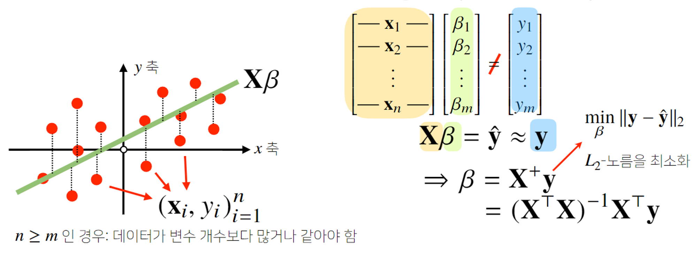
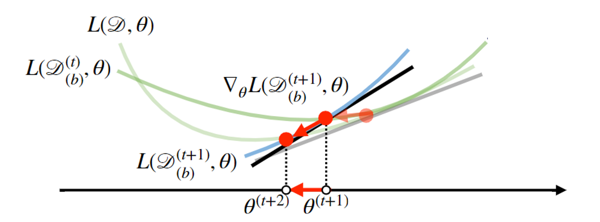

# 4강 경사하강법 - 매운맛
**경사하강법 기반의 선형회귀 알고리즘**에 대해 설명합니다.
경사하강법의 단점을 보완하는 **확률적 경사하강법(stochastic gradient descent)** 을 소개합니다.

## 경사하강법으로 선형회귀 계수 구하기


- objective function
$$\mathbb{E}[\lvert\lvert y-X\beta \rvert\rvert_2]$$
- gradient vector
$$\nabla_\beta\mathbb{E}[\lvert\lvert y-X\beta \rvert\rvert_2]=(\partial{\beta_1}\mathbb{E}[\lvert\lvert y-X\beta \rvert\rvert_2],\dots,\partial{\beta_d}\mathbb{E}[\lvert\lvert y-X\beta \rvert\rvert_2])$$
- partial derivative
    왜 아래 식으로 전개되는가? [Further Question](https://github.com/jinmang2/BoostCamp_AI_Tech_2/tree/beauty/u-stage/ai_math/ch04_gd_spicy/further_question.md)
$$\begin{array}{ll}
\partial{\beta_k}\mathbb{E}[\lvert\lvert y-X\beta \rvert\rvert_2]&=\partial_{\beta_k}\bigg\{ \cfrac{1}{n}\sum_{i=1}^{n}{\bigg(y_i-\sum_{j=1}^{d}X_{ij}\beta_j\bigg)}^2 \bigg\}^{1/2}\\
&=-\cfrac{X_{\cdot k}^{\intercal}(y-X\beta)}{n\lvert\lvert y-X\beta\rvert\rvert_2}
\end{array}$$
- objective funciton을 최소화하는 $\beta$를 구하는 gradient descent algorithm
$$\beta^{(t+1)}=\beta^{(t)}-\lambda\nabla_\beta\lvert\lvert y - X\beta^{(t)}\rvert\rvert$$

- 위에서 계산한 식을 대입
    - 일부로 강의의 수식 말고 RMSE로 적용했다.
    - 관행적으로 L2-Norm과 RMSE를 같이 쓴다고 한다.
$$\beta^{t+1}=\beta^{t}+\cfrac{\lambda}{n}\cfrac{X_\intercal(y - X\beta^{(t)})}{\lvert\lvert y - X\beta^{(t)}\rvert\rvert}$$

- RMSE말고 MSE
$$\beta^{t+1}=\beta^{t}+\cfrac{2\lambda}{n}X^\intercal(y - X\beta^{(t)})$$

```
# 경사하강법 기반 선형회귀 알고리즘
Input: X, y, lr, T
Output: beta
-------------------------------------
norm: L2-norm을 계산하는 함수
lr: 학습률 (learning rate)
T: 학습횟수
-------------------------------------
for t in range(T):
    error = y - X @ beta
    grad = - transpose(X) @ error
    beta = beta - lr * grad
```

## 경사하강법은 만능인가?
- 수학적으로, 만약 목적함수가 **Convex** 하다면 적절한 **learning rate** 과 **Iterative number** 를 선택했을 시에 수렴이 보장되어 있다!
- 뭔가 조건이 많다, 그렇다 만능이 아니다.
- 딥러닝의 대부분의 목적 함수는 convex, 즉 볼록 함수가 아니다!!
- 볼록? 아래처럼 생겨서 gradient가 향하는 방향으로 가면 항상 최소점을 찾아갈 수 있는 도자기처럼 생긴 함수!


## 확률적 경사하강법
- 앞서 언급한 경사하강법은 일반적으론 (사실 대다수) 사용하지 않는, Full-Batch GD이다.
- Full-Batch라 함은 **모든 데이터를 사용해서 학습** 하는 것을 의미한다.
- 이게 smooth하게 학습이 된다는 것은 좋은데, 과연 우리의 메모리가 이를 감당할 수 있을까?
- 당장에 Deberta-xxlarge 모델만 올리기에도 급급한데, 모든 데이터셋을 전부 메모리에 올려서 내부 연산을 수행한다고?
- 사실상 절대 불가능하다. 가능했다면 지금처럼 병렬화 알고리즘이 발전했을 리가 없다. 경량화는 왜 있단 말인가?
- 즉, 핵심은 아래와 같다.
    - 모든 데이터로 업데이트 하는 것이 아니라 데이터 한개 또는 일부를 활용하여 업데이트한다.
    - 한개만 쓰면 SGD, 여러개를 사용하면 mini-batch SGD라고 부른다.
    - 그러나 뭐... 흔히 논문에서 SGD라고 언급하면 mini-batch SGD를 얘기하는 것이다.
- non-convex objective function 목적식을 SGD를 통해 최적화시키는 것이 가능하다.
- 교수님에 따르면, 특히나 DL에선 SGD가 효율적이라는 것이 실증적으로 입증되었다고 한다.

$$\beta^{t+1}=\beta^{t}+\cfrac{2\lambda}{n}X^\intercal(y - X\beta^{(t)})\xrightarrow{\mathcal{O(d^2 n)\;\rightarrow\;\mathcal{O}(d^2 b)}}\beta^{t+1}=\beta^{t}+\cfrac{2\lambda}{b}X_{(b)}^\intercal(y_{(b)} - X_{(b)}\beta^{(t)})$$

- 위 수식을 보면, 연산량이 total dataset size $n$에서 batch size $d$로 줄어드는 것을 확인할 수 있다.



- Full-Batch로 학습하지 않기 때문에 목적식이 계속해서 바뀌게 된다.
- 즉, 학습이 상대적으로 불확실해지지만 아래의 장점 때문에 머신러닝 학습에 더 효율적이다.
    - 연산량 감소 -> OOM 해결 가능
    - non-convex objective function에 사용 가능
