# 3강 최적화 - Optimization

**최적화와 관련된 주요한 용어**와 **다양한 Gradient Descent 기법**들을 배웁니다.

**주요한 용어**: Generalization,Overfitting, Cross-validation 등 다양한 용어가 있습니다. 각 용어들의 의미에 대해 배웁니다.

**다양한 Gradient Descent 기법**: 기존 SGD(Stochastic gradient descent)를 넘어서 최적화(학습)가 더 잘될 수 있도록 하는 다양한 기법들에 대해 배웁니다.

마지막으로, **Gradient Descent 기법에 따른 성능의 변화**를 알아보는 실습을 합니다.

[back to super](https://github.com/jinmang2/boostcamp_ai_tech_2/tree/main/u-stage/dl_basic)

## Introduction
- Gradient Descent
    - First-order iterative optimization algorithm
    - 미분 가능 함수의 `local minimum`을 찾기 위한 알고리즘

    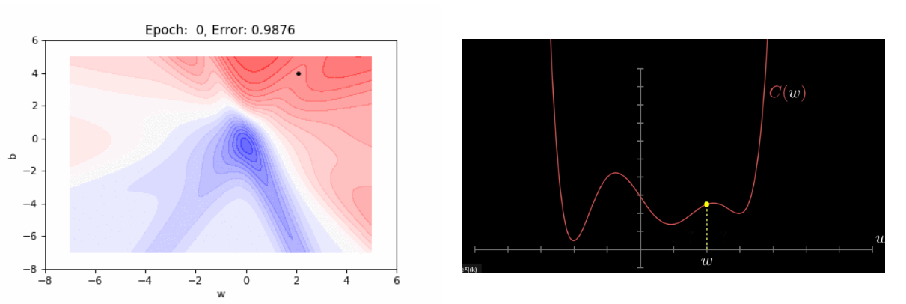

## Important Concepts in Optimization
- [Generalization](#generalization)
- [Underfitting vs Overfitting](#underfitting-vs-overfitting)
- [Cross validation](#cross-validation)
- [Bias Variance tradeoff](#bias-variance-tradeoff)
- [Bootstrapping](#bootstrapping)
- [Bagging and boosting](#bagging-and-boosting)
- 많은 용어들은 통계학에서 고안된 것

### Generalization
- 일반화 성능을 높이는 것이 목표!
    - 일반화 성능이란? 보통, training data와 testing data 간의 성능 차이를 의미
    - unseen data에서 학습된 모델이 잘 행동하면 좋겠다!

    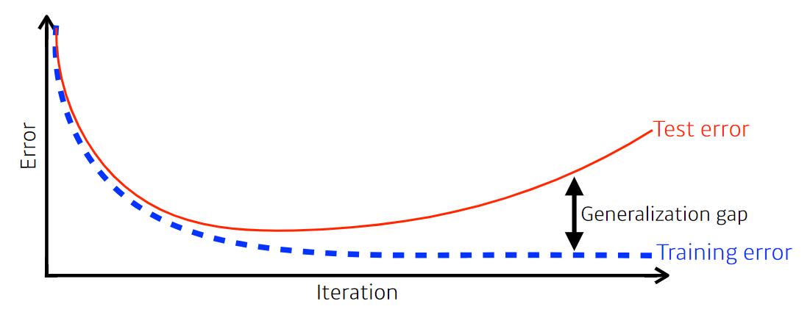

### Underfitting vs Overfitting
- 사실 굉장히 이론적인 얘기임
- 아래 overfitting처럼 학습하는 것이 target일 수 있음!!
- conceptual한 이야기란 걸 기억

### Cross validation
- https://blog.quantinsti.com/cross-validation-machine-learning-trading-models/
- `K-fold` validation라고도 부름
- 어떤 경우에 사용?
    - parameter? 최적해에서 찾고 싶은 값
    - hyperparameter? 우리가 정하는 값
    - 위에 대한 clue가 없음! 이걸로 최적의 hyperparameter set을 찾고
    - 전체 datasets으로 학습!
- test dataset은 어떠한 경우에도 validation에 활용되선 안됨!

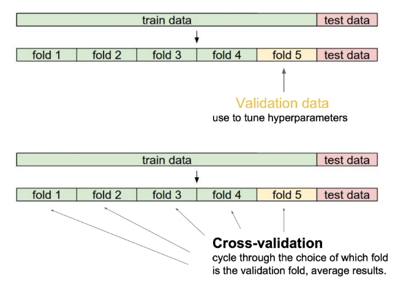

### Bias Variance tradeoff
- https://work.caltech.edu/telecourse

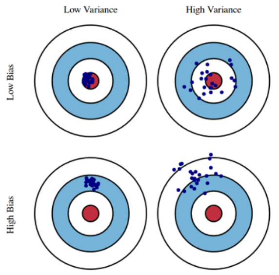

- `Variance` 입력을 넣었을 때 출력이 얼마나 일관적으로 나오는가?
- `Bias`: 평균적으로 봤을 때 mean에서 얼마나 벗어나 있는가?

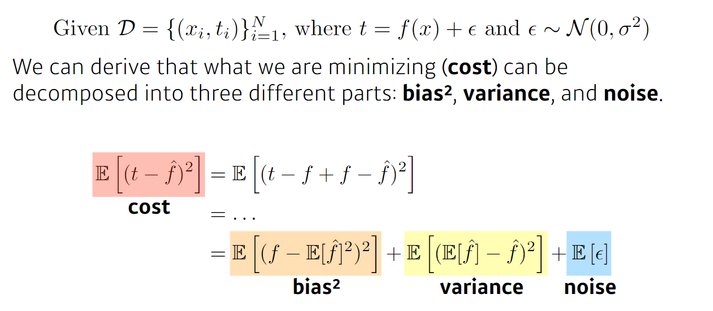

- noise가 껴있을 경우, bias와 variance를 동시에 줄이는 것은 구조적으로 힘듦

### Bootstrapping
- replacement대신 `random sampling`을 사용한 test 혹은 metric
- 모델들이 예측하는 값의 consensus를 확인하고 싶을 때 사용
    - 강화학습에선 예측값을 이용해 예측하는 것을 의미

### Bagging and boosting
- `Bagging` (Bootstrapping Aggregating)
    - 학습 데이터 10만개 고정, 이걸 다 사용하면 성능이 좋을까?
        - 항상 그렇진 않음
    - Ensemble이 bagging에 속할 때가 많음
- `Boosting`
    - 학습 데이터가 100개가 있으면 이를 sequencial하게 바라봄
    - 모델 하나 간단하게 만들고 에러를 학습 학습 학습
        - 이전 모델이 예측을 잘 못한 것을 학습
    - 각 모델은 독립적 x
    - Week Learner들을 모아서 strong하게 만들기

- https://www.datacamp.com/community/tutorials/adaboost-classifier-python

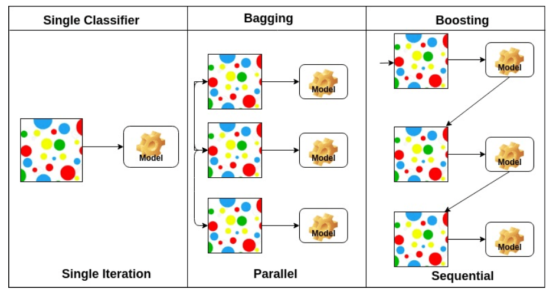

## Practical Gradient Descent Methods
더 자세히 정리한 글을 보고싶으면 [여기](https://github.com/jinmang2/boostcamp_ai_tech_2/tree/main/u-stage/pytorch/ch04_autograd/optimizer)로!

### 크게 아래 세 개로 나눔 (중요하진 X)
- Stochastic GD
- Mini-batch GD
- Batch GD

### Batch Size Matter
- batch size는 무의미한 parameter일까?
    - Nope! 굉장히 중요함
- [On Large-batch Training for Deep Learning Generalization Gap and Sharp Minima](https://arxiv.org/abs/1609.04836)
    - Large Batch size를 사용하면 Sharp Minimizer에 도달
    - Small Batch size를 사용하면 Flat Minimizer에 도달
    - Sharp보단 Flat에 도달하는 것이 좀 더 좋다

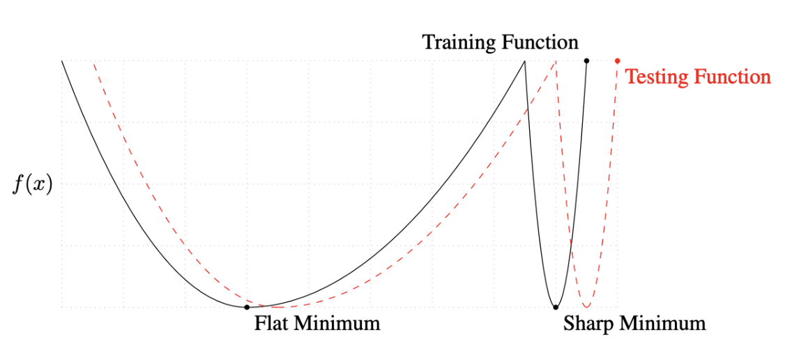

- Flat minima의 특징?
    - Training data에서 잘 되면 Testing data에서도 잘 될 것

#### Q) Deepmind의 논문과 정반대의 얘기를 하고있는걸까?

## Various Gradient Descent
- Stochastic gradient descent
- Momentum
- Nesterov accelerated gradient
- Adagrad
- Adadelta
- RMSprop
- Adam

### Gradient Descent

$$W_{t+1}\leftarrow W_t - \eta g_t$$

- learning rate잡기가 너무 어려움 ㅠㅠ

### Momemtum

$$a_{t+1}\leftarrow \beta a_t + g_t$$

$$W_{t+1}\leftarrow W_t - \eta a_{t+1}$$

- 이전 정보를 조금 더 이어가는 기법 (관성)
- $\beta$는 관성에 관련된 hyperparameter임
- $a_{t+1}$는 accumulation임 (momentum이 포함된 gradient)

### NAG (Nesterov Accelerated Gradient)

$$a_{t+1}\leftarrow \beta a_t + \nabla\mathcal{L}(W_t - \eta \beta a_t)$$

$$W_{t+1}\leftarrow W_t - \eta a_{t+1}$$

- gradient를 계산할 때 `Lookahead gradient`를 계산
- 얘는 한 번 이동함
- https://golden.com/wiki/Nesterov_momentum

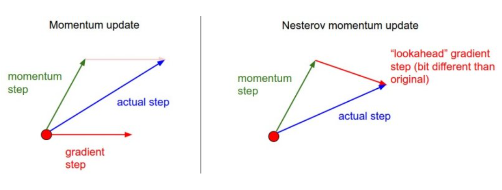

- local minima 봉우리 안에서 더 빠르게 수렴 가능

### Adagrad
- 위의 momentum류와는 다른 계열
- NN의 Parameter가 지금까지 얼마나 많이 변해왔는지를 기준으로 update
- 적게 변한 친구를 더 많이 변하게 하고싶음

$$W_{t+1}= W_t - \cfrac{\eta}{\sqrt{G_t + \epsilon}} g_t$$

- $G_t$: 지금까지 변한 gradient들의 합
- $\epsilon$: 분모가 0이 되지 않게! (numerical stability)
- 문제가 뭐냐, $G_t$는 계속해서 커짐!
    - 뒤로 가면 갈수록 학습이 멈추는 현상이 발생

### Adadelta
- accumulation이 계속해서 커지는 현상을 막겠다!!

$$G_t = \gamma G_{t-1} + (1-\gamma) g_t^2$$

$$W_{t+1}= W_t - \cfrac{\sqrt{H_{t-1}+\epsilon}}{\sqrt{G_t + \epsilon}} g_t$$

$$H_t=\gamma H_{t-1}+(1-\gamma)(\Delta W_t)^2$$

- learning rate가 없음
    - 우리가 바꿀 수 있는 요소가 많지 않음
    - 그래서 많이 사용되진 않음...
- GPT-3 천억개의 parameter? 그럼 $G_t$도 천억개...
- exponential moving average를 통해 $G_t$를 가짐
- $G_t$: EMA of gradient squares
- $H_t$: EMA of difference gradients

### RMSprop
- 많이 쓰이고 재밌음
- 논문에서 제안된건 아님

$$G_t=\gamma G_{t-1}+(1-\gamma)g_t^2$$

$$W_{t+1}=W_t - \cfrac{\eta}{\sqrt{G_t + \epsilon}}g_t$$

### Adam
- Adaptive Moment Estimation (Adam)
- momentum과 adaptive learning rate를 합친 방법

$$m_t=\beta_1 m_{t=1} + (1-\beta_1)g_t$$

$$v_t=\beta_2 v_{t-1} + (1-\beta_2)g_t^2$$

$$W_{t+1}=W_t -\cfrac{\eta}{\sqrt{v_t+\epsilon}}$$

- `m_t`: Momemtum
- `v_t`: EMA of gradient squares

- 아담은 효과적으로 momemtum과 adaptive learning rate 접근을 결합함!

## Regularization
- [Early stopping](#early-stopping)
- [Parameter norm penalty](#parameter-norm-penalty)
- [Data augmentation](#data-augmentation)
- [Noise robustness](#noise-robustness)
- [Label smoothing](#label-smoothing)
- [Dropout](#dropout)
- [Batch normalization](#batch-normalization)
- 학습 데이터 뿐만 아니라 테스트 데이터 셋에도 잘 동작하도록!

더 자세히 정리한 글을 보고싶으면 [여기](https://github.com/jinmang2/boostcamp_ai_tech_2/tree/main/u-stage/dl_basic/ch03_optimization/regularization)로!

### Early stopping
- validation error로 학습을 언제 멈출지 판단!

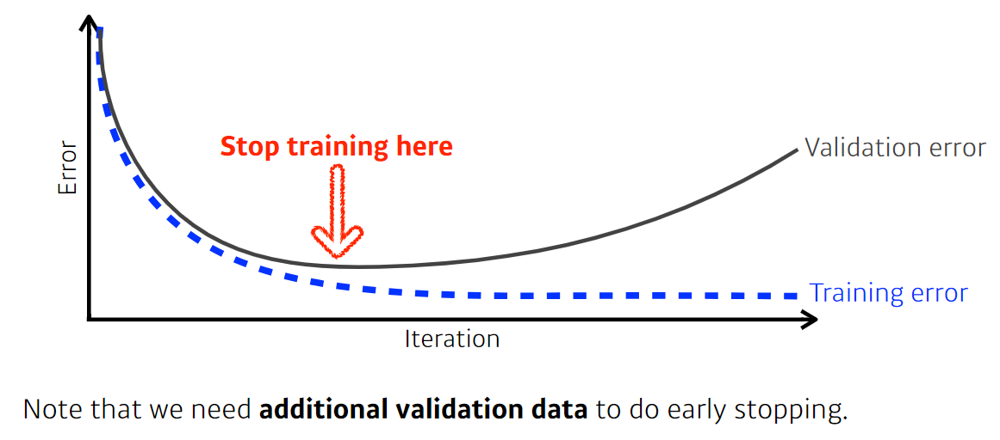

### Parameter norm penalty
- `weight decay`
- 가정: 부드러운 함수일 수록 일반화를 더 잘 할 것이다!
- function space에 `smoothness`를 부여

### Data augmentation
- 더 많은 데이터는 항상 Welcome임!!

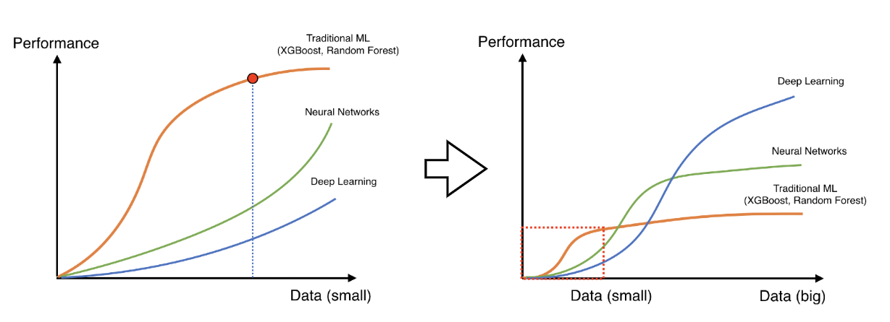

### Noise robustness
- Add random noises inputs or weights
- Denoising Auto Encoder, BART, BERT 등 다양한 아이디어로 확장

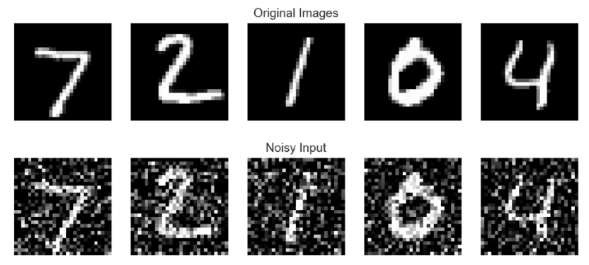

### Label smoothing
- `Mix-up`: 데이터를 뽑아서 섞어줌!
    - 교수님의 경험 상, 성능이 정말 많이많이 올라감
- Data Augmentation과 유사
- Decision Boundary를 부드럽게 만들어준다!

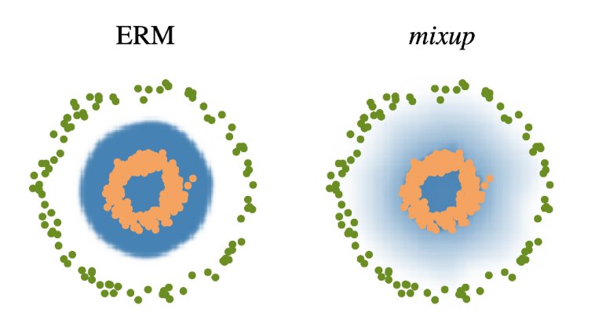

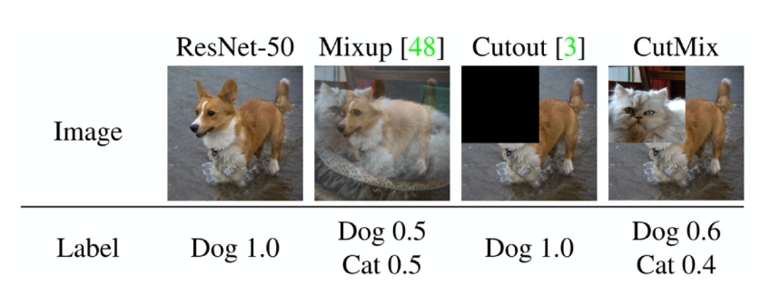

### Dropout
- forward 패스 시에 몇몇 뉴런을 zero로

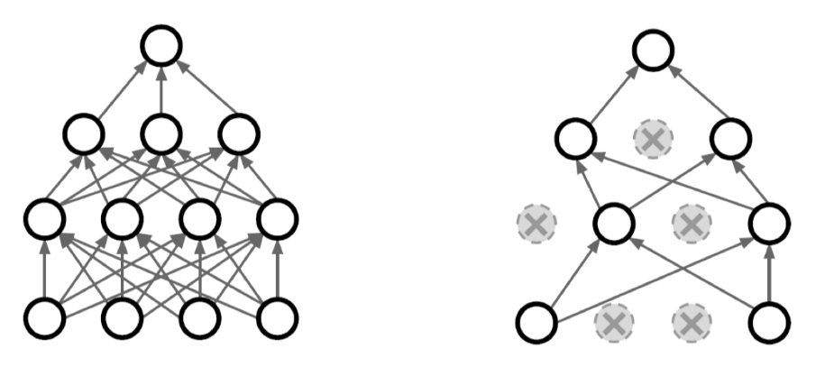

### Batch Normalization
- 논란이 많은 논문!
    - `internal covariant shift`에 문제가 많음
    - covariant는 feature와 같은 말

