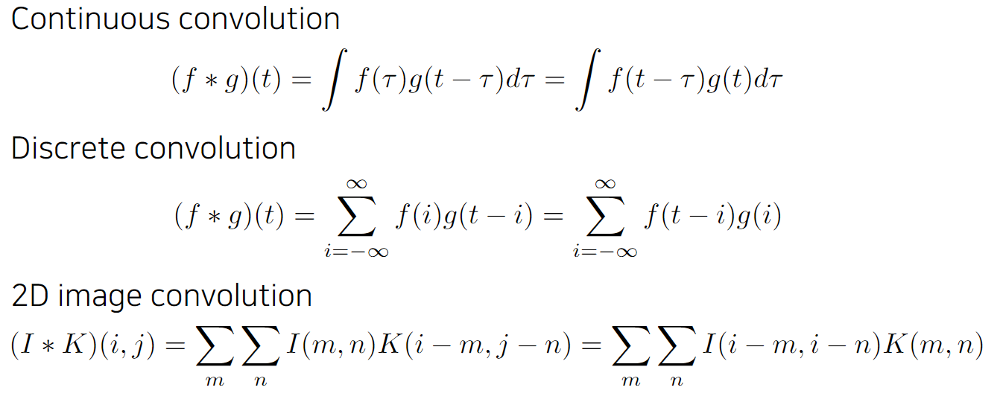
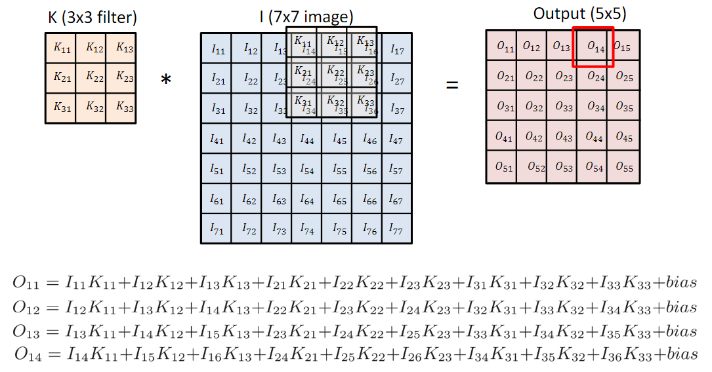
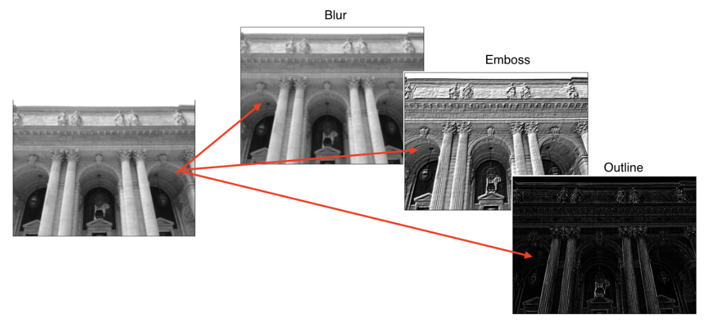
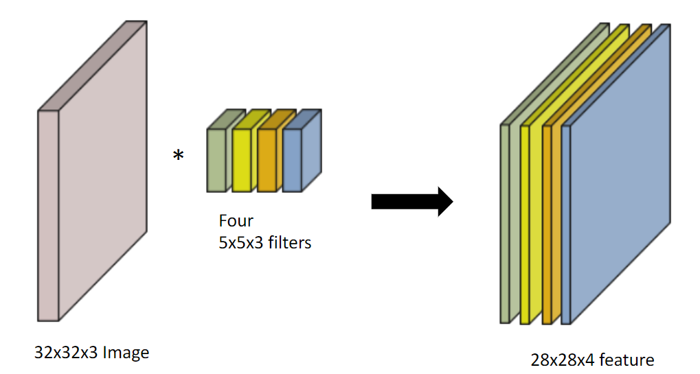
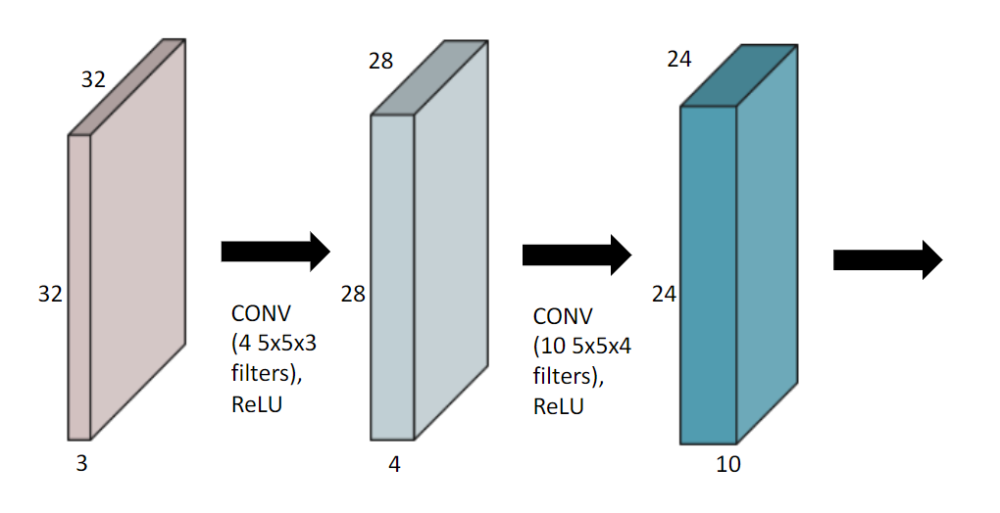
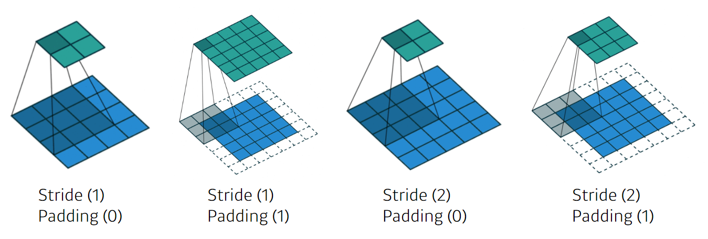
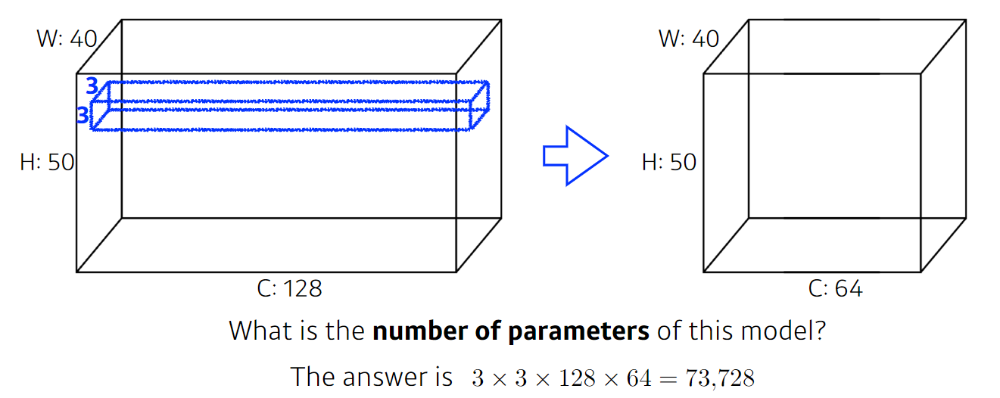
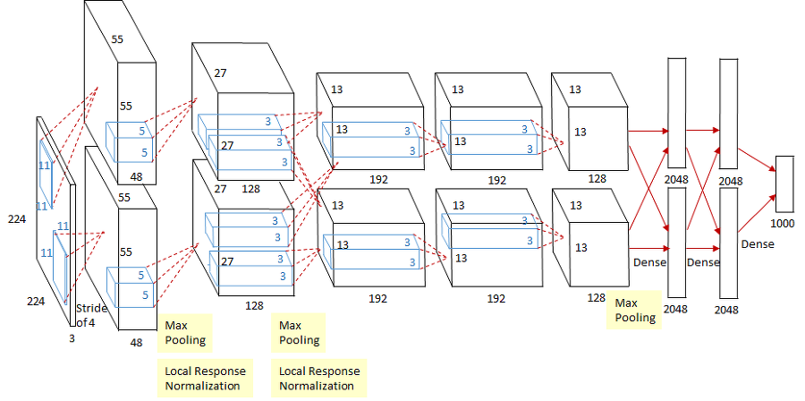
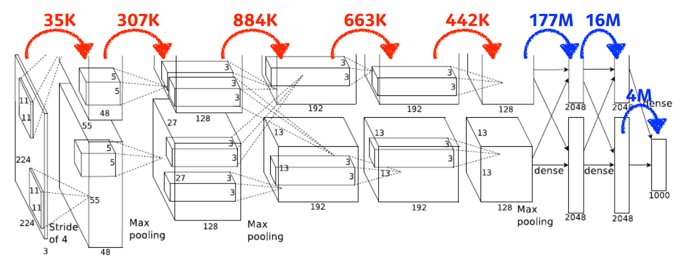
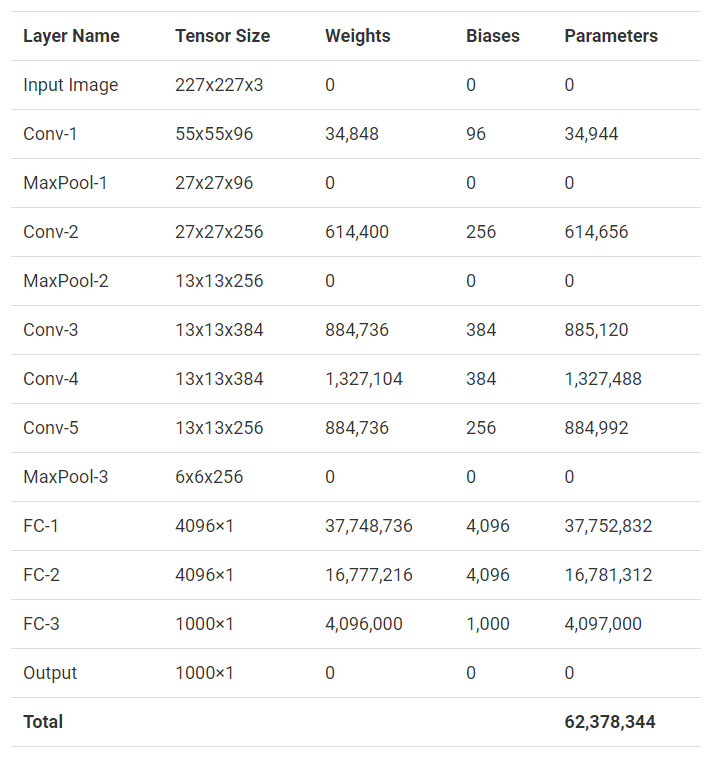

# 4강 CNN (Convolutional Neural Network)
- CNN의 가장 중요한 연산은 `Convolution`임
- CNN에 대해 공부하기 전에 **Convolution의 정의**, **Convolution 연산 방법과 기능** 에 대해 배운다.
- 가장 기본적인 **CNN(Convolutional Neural Network)** 에 대해서도 학습한다.

[back to super](https://github.com/jinmang2/boostcamp_ai_tech_2/tree/main/u-stage/dl_basic)

## Convolution
- Convolution은 아래의 연산을 의미



- 여기에 오타있음!!

- `zero padding`, `stride`를 고려하지 않고 기본적으로 아래처럼 생각을 가능
    - 도장을 찍는다고 표현!



- 2D convolution의 효과는?



## RGB Image Convolution



```python
import torch.nn

model = nn.Conv2d(in_channels=3, out_channels=4, kernel_size=5)
print(model)
print(sum(p.numel() for p in model.parameters()))
```
```python
Conv2d(3, 4, kernel_size=(5, 5), stride=(1, 1))
304 # 5*5*3*4 + 1*4
```

## Stack of Convolutions
- 이 연산을 정의하는데 필요한 parameter의 숫자를 항상 염두해야함!



```python
import torch.nn

model = nn.Sequential(
    nn.Conv2d(in_channels=3, out_channels=4, kernel_size=5),
    nn.ReLU(),
    nn.Conv2d(in_channels=4, out_channels=10, kernel_size=5),
    nn.ReLU(),
)
print(model)
print(sum(p.numel() for p in model.parameters()))
```
```python
Sequential(
  (0): Conv2d(3, 4, kernel_size=(5, 5), stride=(1, 1))
  (1): ReLU()
  (2): Conv2d(4, 10, kernel_size=(5, 5), stride=(1, 1))
  (3): ReLU()
)
1314 # 5*5*3*4 + 1*4 + 5*5*4*10 + 1*10
```

## Convolutional Neural Networks
- CNN은 `convolution layer`, `pooling layer`, `fully connected layer`로 구성
    - `convolution layer`, `pooling layer`: feature extraction
    - `fully connected layer`: decision making
- 최근엔 뒤에 `fully connected layer`를 줄이려는 추세임


## Convolution Arithmetic
- 직접 아래 table이 맞는지 손으로 계산해보기!


### Stride
- convolution filter를 얼마나 자주, 얼마나 dense하게 찍을 것인가


### padding
- 가장자리 처리!


### Stride? Padding?
- 적절한 수의 padding과 stride 1로 출력 이미지의 크기를 입력과 동일하게 출력시키는 것이 가능



- size를 어떻게 맞춰주는가?
    - https://discuss.pytorch.org/t/how-to-keep-the-shape-of-input-and-output-same-when-dilation-conv/14338

```
o = output
p = padding
k = kernel_size
s = stride
d = dilation
o = [i + 2*p - k - (k-1)*(d-1)]/s + 1
```



### Exercise
- AlexNet
    - 두 path로 나뉘어짐! 왜? GPU 메모리...



- 교수님은 아래처럼 parameter의 수를 계산하셨다.



- 이게 왜 위처럼 계산되느냐? 우선 아래 표를 보자
    - https://learnopencv.com/number-of-parameters-and-tensor-sizes-in-convolutional-neural-network/



- 무언가를 눈치챘는가? 위 AlexNet 그림에서 `Conv-3`, `Fc-2`, `Fc-3` 제외 전부 파라미터의 수가 1/2이다.
- GPU 메모리 절감을 위해 cross되는 부분을 줄인 것으로 확인된다.
- 그리고 저건 사소한 구현 이슈같은데, AlexNet의 입력 크기가 흔히들 `227 X 227`이라고 한다.
- 그냥, `224 X 224` `padding=2` 주면 되긴하지만... 뭐 알아는 두자.
- 승현님에 의하면, `Interchange`가 일어나기 때문이라고 한다.
    - `Response normalization`
    - 요새는 사용하지 않는다고 함
    - pixel의 값?

### boostcamp 질의응답
- 다른 캠퍼분의 질문에 내가 한 답을 기입

```
Q)  첫번째 레이어에서 교수님이 224*224*3이 입력으로 들어온다고 하셨습니다.
    224에 stride인 4를 나누면 56이고, 0부터 시작하므로 0~54번째 스탭 까지 갔을때
    그림에 나오는 55*55가 만들어진다고 계산이 되었습니다.
    그런데 54*4는 216이고, 여기에 11을 더하면 227이 됩니다.
    그래서 저는 0을 padding 해야 하는게 아닌가 하는 생각이 들었습니다.
    근데 패딩은 테두리 전체에 적용시키는건데,
    이러한 경우에 224에서 227까지 부족한것은 3입니다.
    이런경우 좌 우로 패딩을 하게 되면 명시된 55*55가 나올 수가 없다고 생각이 됩니다.
    혹시 패딩을 오른쪽 혹은 왼쪽 테두리에만  적용시킬 수 있는건가요?
```

#### A)
이게 저도 궁금해서 찾아봤는데요, 원래 AlexNet의 input size는 227 X 227이라고 합니다!
다만, 교수님 강의에서 사진처럼 224 X 224가 들어온다면 padding=2를 옵션으로 줘서 shape을 맞춰줘야 정상적으로 output이 출력되더라구요!
```python
import torch
import torch.nn as nn

x = torch.randn(1, 3, 224, 224) # bsz, n_channels, width, height)
conv1 = nn.Conv2d(
    in_channels=3,
    out_channels=48,
    kernel_size=5,
    stride=4,
    padding=2
)
conv1(x).size() # torch.Size([1, 48, 55, 55])
```
padding에 2 혹은 3을 주면 아래 공식에 맞춰서 맞는 shape을 돌려주는데요,

https://discuss.pytorch.org/t/how-to-keep-the-shape-of-input-and-output-same-when-dilation-conv/14338

아래 `torch.nn.functional.pad` 함수를 보시면 height, width 어디에 패딩을 줄지 결정할 수 있어요!
https://hichoe95.tistory.com/116
cpp 코드를 뜯어보진 않았지만 padding과 padding_mode 인자를 통해 위 함수를 조절하여 padding을 해주는 것으로 생각됩니다! (좌우에 따로 적용 가능)

p.s. `torch.nn.functional`의 `pad`함수는 아래처럼 사용한다고 합니다.
1. 3차원 (자연어처럼 bsz, seq_len, hid_dim의 shape을 가질 경우)
    - pad 인자에 (1, 1)과 같이 인자를 부여
    - 위 패딩은 마지막 hid_dim에 걸린다고 하네요
2. 4차원 (이미지처럼 bsz, n_channel, width, height)
    - pad 인자에 (1, 1, 2, 2)와 같이 인자를 부여
    - 앞의 (1, 1)은 height에, 뒤의 (2, 2)는 width에 걸린다고 하네요!

몇 가지 실험해본 결과, `(p1, p2, p3, p4)`는 다음과 같은 option이더라구요!
- `p1`은 height 맨 앞에 패딩
- `p2`는 height 맨 뒤에 패딩
- `p3`는 width 맨 앞에 패딩
- `p4`는 width 맨 뒤에 패딩

`nn.Conv2d`에서 padding은 integer를 줄 수도 있고 tuple 형태로도 줄 수 있어서 실제로 어떻게 들어가는지 저도 궁금하긴 한데, 내부적으로 위의 shape으로 맞춰주는 처리가 들어갈 것 같습니다!

`pad`함수의 소스코드는 아래의 링크에서 참고하시면 될 것 같습니다!
https://github.com/pytorch/pytorch/blob/9e7b6bb69f3c318ec407ac88572e79c1fdcb0ab5/torch/nn/functional.py#L4104

```python
>>> import torch
>>> import torch.nn.functional as F
>>>
>>> x = torch.randn(1, 3, 224, 224)
>>> F.pad(x, pad=(1,0,0,0)).size()
torch.Size([1, 3, 224, 225])
>>> F.pad(x, pad=(1,1,0,0)).size()
torch.Size([1, 3, 224, 226])
>>> F.pad(x, pad=(2,1,0,0)).size()
torch.Size([1, 3, 224, 227])
>>> F.pad(x, pad=(2,2,0,0)).size()
torch.Size([1, 3, 224, 228])
>>> F.pad(x, pad=(2,2,1,0)).size()
torch.Size([1, 3, 225, 228])
>>> F.pad(x, pad=(2,2,1,1)).size()
torch.Size([1, 3, 226, 228])
>>> F.pad(x, pad=(2,2,2,1)).size()
torch.Size([1, 3, 227, 228])
>>> F.pad(x, pad=(2,2,2,2)).size()
torch.Size([1, 3, 228, 228])
```
