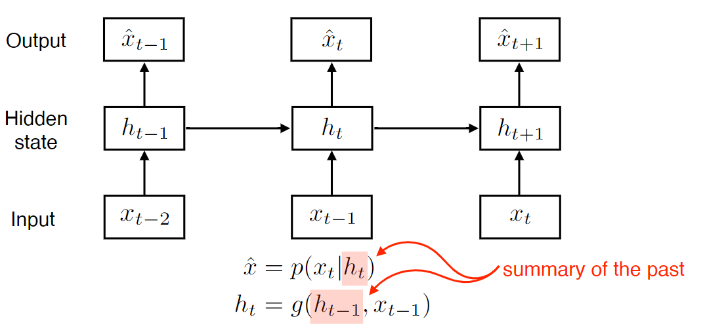
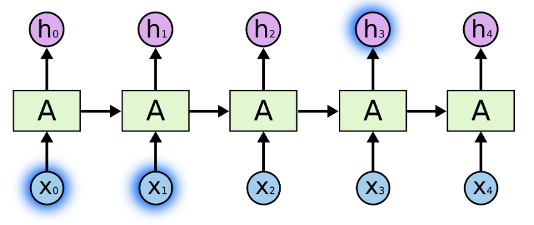
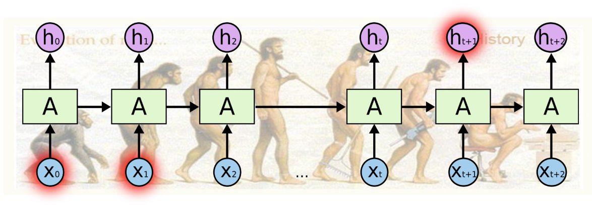
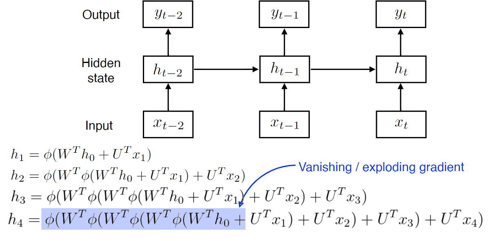
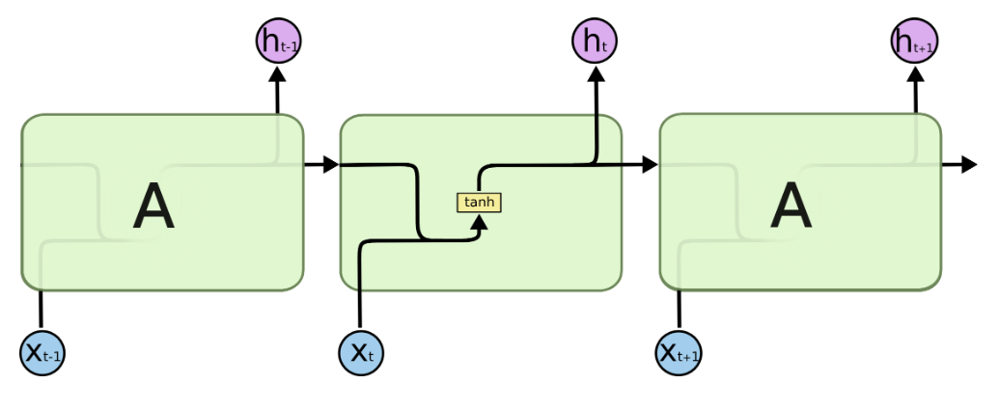
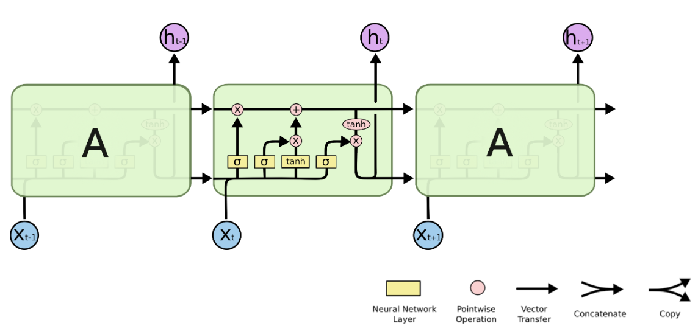
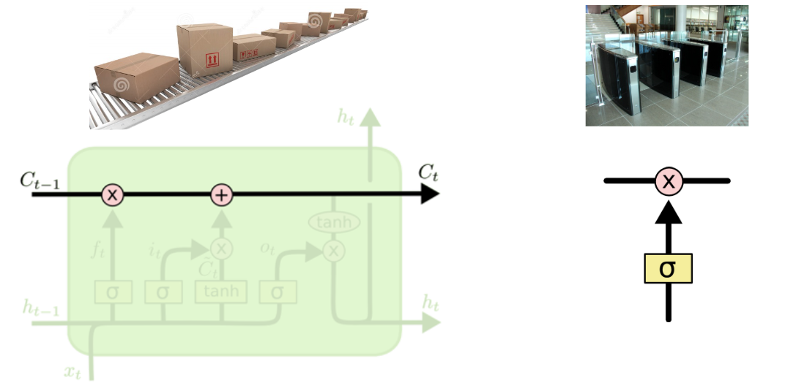
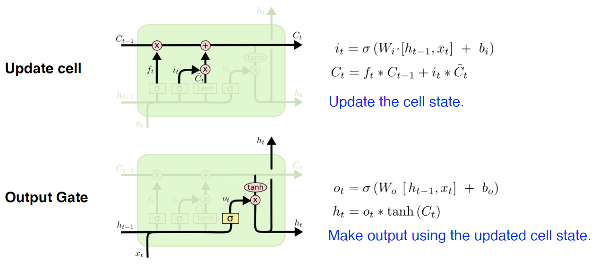
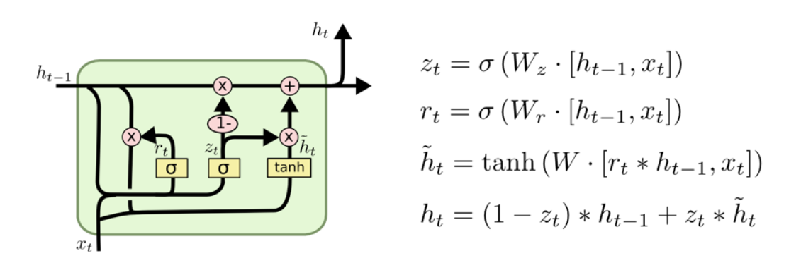

# 7강 Sequential Models - RNN

- 주식, 언어와 같은 Sequential data와 이를 이용한 **Sequential model의 정의와 종류에** 대해 배웁니다.
- 그 후 딥러닝에서 sequential data를 다루는 **Recurrent Neural Networks 에 대한 정의와 종류에** 대해 배웁니다.

[back to super](https://github.com/jinmang2/boostcamp_ai_tech_2/tree/main/u-stage/dl_basic)

## Sequential Model
- 가변적인 길이의 sequence를 어떻게 모델링할 것인가?

### Naive sequential model
- 입력이 여러 개 들어왔을 때 다음에 어떤 데이터가 등장할 것인가?
- 점점 고려해야할 정보량이 늘어남

### Autoregressive model
- 과거 정보를 얼마나 참고할지 고정적으로!
    - past timespan을 고정

    

### Markov model (first-order autoregressive model)
- 쉽게 모델링할 수 있는 방법 중 하나!
- 강화학습 MDP의 Markov임!
- 내가 가정을 하기로,
    - 나의 현재는 바로 전 과거의 영향만 받는다!
- 이건 참... ㅎㅎ... 말이 안되는 가정이다
    - 정말 많은 정보를 버리게 된다.
    - 그래도 수학적으로 아래처럼 굉장히 편해진다!

### Latent autoregressive model
- 내가 과거에 많은 정보를 고려해야하는데, 이 `가변 길이`를 어떻게 효율적으로 처리할까?
- 과거 정보의 요약만 챙기면 안될까? 우리가 뉴스레터 구독하듯이!

## Recurrent Neural Network
- MLP과 동일한 구조이지만 자기 자신으로 돌아오는 구조가 있다는 것!
- 입력 `x_t`와 이전 cell state `h_t` 두 개에 dependent함!

- time축으로 출면 위와 같은 구조로 볼 수 있음
- 이렇게 풀게 되면, 입력이 굉장히 많은 Fully Connected Layer로 표현 가능
    - parameter sharing이 들어가죠?
    - 그래서 이미 deep한...

### Short-term dependencies
- 과거의 정보를 summarize해서 미래에 고려해야 함
- RNN은 하나의 cell로 정보를 요약해서 저장함
- 나중에 갈수록 잊어버리게 됨...
- 단기 기억에 강한 모델이 되버림

### Long-term dependencies
- 위에서 언급했듯, 장기 기억 포착이 RNN의 가장 취약한 단점임

### Vanishing / Exploding Gradient
- RNN은 layer를 쌓지 않아도 이미 deep함!

### Vanilla RNN

## Long Short Term Memory
- 이게 어떻게 long-term dependency를 포착할 수 있을까?

- Cell State를 추가하여 과거 정보를 잘 다루도록 할 것임!
- 얼마나 잊을건지, 그리고 어떤 정보는 가져갈 것인지 아래 구조로 결정!

### Core Idea
- Cell State: 컨베이너 벨트임
    - 어떤 정보가 유용하고 유용하지 않은지
    - 이에 따라 어떻게 처리할 지!

### Forget and Input Gate
- Forget Gate는 새로운 정보, 이전 정보 중 얻을 것을 계산
- Input Gate
    - $i_t=\sigma (W_i \cdot [h_{t-1},x_t] + b_i)$
        - 어떤 정보를 올릴지?
    - $\tilde{C}_t=\tanh (W_C \cdot [h_{t-1},x_t] + b_C)$
        - 올릴 정보를 계산!

### Update Cell and Output Gate
- Update Cell
    - $C_t = f_t * C_{t-1} + i_t * \tilde{C}_t$
        - 보면, 앞의 $f_t$와 $i_t$는 `sigmoid`로 연산된 친구들이다.
        - 즉, 얼마나 뒤의 정보를 반영할 지를 확률로 던져주는 역할
        - `tanh`로 계산된 term이 우리의 정보량이라고 이해할 수 있다.

- Output Gate
    - $o_t = \sigma (W_o \cdot [h_{t-1}, x_t] + b_o)$
    - $h_t = o_t * \tanh (C_t)$
    - 어떤 값을 output으로 뽑아낼지!

## GRU
- LSTM의 구조를 단순화!
- reset gate와 update gate만 사용
    - LSTM은 3개의 gate가 있었음
- No cell state, just hidden state
- GRU를 사용할 때 성능이 올라가는 경우가 꽤 보임
    - parameter도 적음!
- 요즘에는 사실 사용안되는 구조에요 ㅎㅎ

## 더 상세한 내용 정리
- 코드 및 further question을 아래에 정리해 두었습니다!
- [Further Questions](https://github.com/jinmang2/boostcamp_ai_tech_2/tree/main/u-stage/dl_basic/ch07_rnn/further_question.md)
